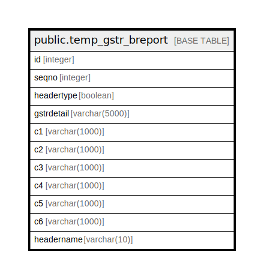

# public.temp_gstr_breport

## Description

## Columns

| Name | Type | Default | Nullable | Children | Parents | Comment |
| ---- | ---- | ------- | -------- | -------- | ------- | ------- |
| id | integer | nextval('temp_gstr_breport_id_seq'::regclass) | false |  |  |  |
| seqno | integer |  | true |  |  |  |
| headertype | boolean |  | true |  |  |  |
| gstrdetail | varchar(5000) |  | true |  |  |  |
| c1 | varchar(1000) |  | true |  |  |  |
| c2 | varchar(1000) |  | true |  |  |  |
| c3 | varchar(1000) |  | true |  |  |  |
| c4 | varchar(1000) |  | true |  |  |  |
| c5 | varchar(1000) |  | true |  |  |  |
| c6 | varchar(1000) |  | true |  |  |  |
| headername | varchar(10) |  | true |  |  |  |

## Constraints

| Name | Type | Definition |
| ---- | ---- | ---------- |
| temp_gstr_breport_pkey | PRIMARY KEY | PRIMARY KEY (id) |

## Indexes

| Name | Definition |
| ---- | ---------- |
| temp_gstr_breport_pkey | CREATE UNIQUE INDEX temp_gstr_breport_pkey ON public.temp_gstr_breport USING btree (id) |

## Relations

---

> Generated by [tbls](https://github.com/k1LoW/tbls)
