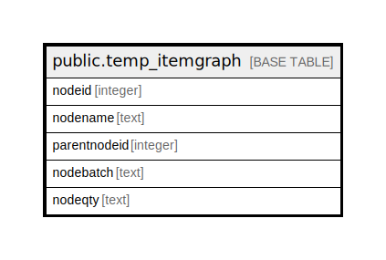

# public.temp_itemgraph

## Description

## Columns

| Name | Type | Default | Nullable | Children | Parents | Comment |
| ---- | ---- | ------- | -------- | -------- | ------- | ------- |
| nodeid | integer | nextval('temp_itemgraph_nodeid_seq'::regclass) | false |  |  |  |
| nodename | text |  | true |  |  |  |
| parentnodeid | integer |  | true |  |  |  |
| nodebatch | text |  | true |  |  |  |
| nodeqty | text |  | true |  |  |  |

## Relations

---

> Generated by [tbls](https://github.com/k1LoW/tbls)
