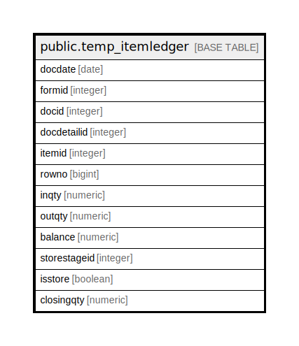

# public.temp_itemledger

## Description

## Columns

| Name | Type | Default | Nullable | Children | Parents | Comment |
| ---- | ---- | ------- | -------- | -------- | ------- | ------- |
| docdate | date |  | true |  |  |  |
| formid | integer |  | true |  |  |  |
| docid | integer |  | true |  |  |  |
| docdetailid | integer |  | true |  |  |  |
| itemid | integer |  | true |  |  |  |
| rowno | bigint |  | true |  |  |  |
| inqty | numeric |  | true |  |  |  |
| outqty | numeric |  | true |  |  |  |
| balance | numeric |  | true |  |  |  |
| storestageid | integer |  | true |  |  |  |
| isstore | boolean |  | true |  |  |  |
| closingqty | numeric |  | true |  |  |  |

## Relations

---

> Generated by [tbls](https://github.com/k1LoW/tbls)
