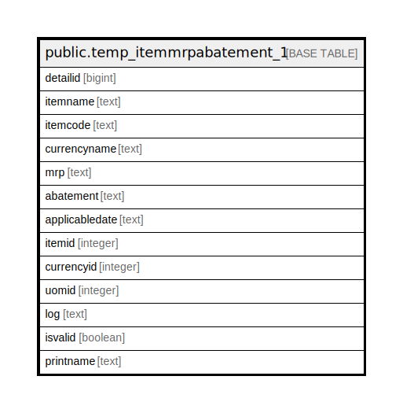

# public.temp_itemmrpabatement_1

## Description

## Columns

| Name | Type | Default | Nullable | Children | Parents | Comment |
| ---- | ---- | ------- | -------- | -------- | ------- | ------- |
| detailid | bigint |  | false |  |  |  |
| itemname | text |  | true |  |  |  |
| itemcode | text |  | true |  |  |  |
| currencyname | text |  | true |  |  |  |
| mrp | text |  | true |  |  |  |
| abatement | text |  | true |  |  |  |
| applicabledate | text |  | true |  |  |  |
| itemid | integer |  | true |  |  |  |
| currencyid | integer |  | true |  |  |  |
| uomid | integer |  | true |  |  |  |
| log | text |  | true |  |  |  |
| isvalid | boolean |  | true |  |  |  |
| printname | text |  | true |  |  |  |

## Constraints

| Name | Type | Definition |
| ---- | ---- | ---------- |
| temp_itemmrpabatement_1_pkey | PRIMARY KEY | PRIMARY KEY (detailid) |

## Indexes

| Name | Definition |
| ---- | ---------- |
| temp_itemmrpabatement_1_pkey | CREATE UNIQUE INDEX temp_itemmrpabatement_1_pkey ON public.temp_itemmrpabatement_1 USING btree (detailid) |

## Relations

---

> Generated by [tbls](https://github.com/k1LoW/tbls)
