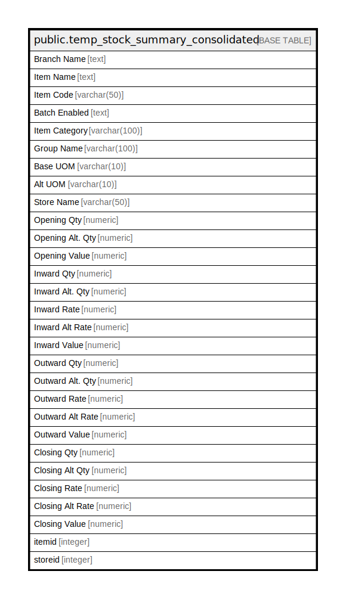

# public.temp_stock_summary_consolidated

## Description

## Columns

| Name | Type | Default | Nullable | Children | Parents | Comment |
| ---- | ---- | ------- | -------- | -------- | ------- | ------- |
| Branch Name | text |  | true |  |  |  |
| Item Name | text |  | true |  |  |  |
| Item Code | varchar(50) |  | true |  |  |  |
| Batch Enabled | text |  | true |  |  |  |
| Item Category | varchar(100) |  | true |  |  |  |
| Group   Name | varchar(100) |  | true |  |  |  |
| Base UOM | varchar(10) |  | true |  |  |  |
| Alt UOM | varchar(10) |  | true |  |  |  |
| Store Name | varchar(50) |  | true |  |  |  |
| Opening Qty | numeric |  | true |  |  |  |
| Opening Alt. Qty | numeric |  | true |  |  |  |
| Opening Value | numeric |  | true |  |  |  |
| Inward Qty | numeric |  | true |  |  |  |
| Inward Alt. Qty | numeric |  | true |  |  |  |
| Inward Rate | numeric |  | true |  |  |  |
| Inward   Alt Rate | numeric |  | true |  |  |  |
| Inward Value | numeric |  | true |  |  |  |
| Outward Qty | numeric |  | true |  |  |  |
| Outward Alt. Qty | numeric |  | true |  |  |  |
| Outward Rate | numeric |  | true |  |  |  |
| Outward Alt Rate | numeric |  | true |  |  |  |
| Outward Value | numeric |  | true |  |  |  |
| Closing Qty | numeric |  | true |  |  |  |
| Closing Alt Qty | numeric |  | true |  |  |  |
| Closing Rate | numeric |  | true |  |  |  |
| Closing Alt Rate | numeric |  | true |  |  |  |
| Closing Value | numeric |  | true |  |  |  |
| itemid | integer |  | true |  |  |  |
| storeid | integer |  | true |  |  |  |

## Relations

---

> Generated by [tbls](https://github.com/k1LoW/tbls)
