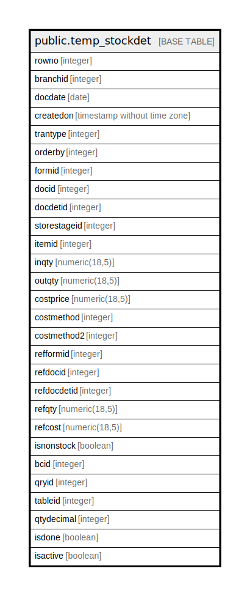

# public.temp_stockdet

## Description

## Columns

| Name | Type | Default | Nullable | Children | Parents | Comment |
| ---- | ---- | ------- | -------- | -------- | ------- | ------- |
| rowno | integer |  | false |  |  |  |
| branchid | integer |  | false |  |  |  |
| docdate | date |  | false |  |  |  |
| createdon | timestamp without time zone |  | false |  |  |  |
| trantype | integer |  | false |  |  |  |
| orderby | integer |  | true |  |  |  |
| formid | integer |  | false |  |  |  |
| docid | integer |  | false |  |  |  |
| docdetid | integer |  | false |  |  |  |
| storestageid | integer |  | false |  |  |  |
| itemid | integer |  | false |  |  |  |
| inqty | numeric(18,5) | 0 | false |  |  |  |
| outqty | numeric(18,5) | 0 | false |  |  |  |
| costprice | numeric(18,5) | 0 | false |  |  |  |
| costmethod | integer |  | false |  |  |  |
| costmethod2 | integer |  | true |  |  |  |
| refformid | integer |  | true |  |  |  |
| refdocid | integer |  | true |  |  |  |
| refdocdetid | integer |  | true |  |  |  |
| refqty | numeric(18,5) |  | true |  |  |  |
| refcost | numeric(18,5) |  | true |  |  |  |
| isnonstock | boolean | false | false |  |  |  |
| bcid | integer |  | true |  |  |  |
| qryid | integer |  | false |  |  |  |
| tableid | integer |  | false |  |  |  |
| qtydecimal | integer | 0 | false |  |  |  |
| isdone | boolean | false | false |  |  |  |
| isactive | boolean | true | false |  |  |  |

## Relations

---

> Generated by [tbls](https://github.com/k1LoW/tbls)
