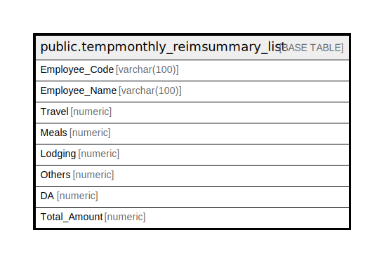

# public.tempmonthly_reimsummary_list

## Description

## Columns

| Name | Type | Default | Nullable | Children | Parents | Comment |
| ---- | ---- | ------- | -------- | -------- | ------- | ------- |
| Employee_Code | varchar(100) |  | true |  |  |  |
| Employee_Name | varchar(100) |  | true |  |  |  |
| Travel | numeric |  | true |  |  |  |
| Meals | numeric |  | true |  |  |  |
| Lodging | numeric |  | true |  |  |  |
| Others | numeric |  | true |  |  |  |
| DA | numeric |  | true |  |  |  |
| Total_Amount | numeric |  | true |  |  |  |

## Relations

---

> Generated by [tbls](https://github.com/k1LoW/tbls)
