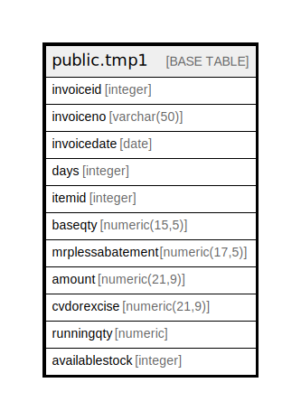

# public.tmp1

## Description

## Columns

| Name | Type | Default | Nullable | Children | Parents | Comment |
| ---- | ---- | ------- | -------- | -------- | ------- | ------- |
| invoiceid | integer |  | true |  |  |  |
| invoiceno | varchar(50) |  | true |  |  |  |
| invoicedate | date |  | true |  |  |  |
| days | integer |  | true |  |  |  |
| itemid | integer |  | true |  |  |  |
| baseqty | numeric(15,5) |  | true |  |  |  |
| mrplessabatement | numeric(17,5) |  | true |  |  |  |
| amount | numeric(21,9) |  | true |  |  |  |
| cvdorexcise | numeric(21,9) |  | true |  |  |  |
| runningqty | numeric |  | true |  |  |  |
| availablestock | integer |  | true |  |  |  |

## Relations

---

> Generated by [tbls](https://github.com/k1LoW/tbls)
