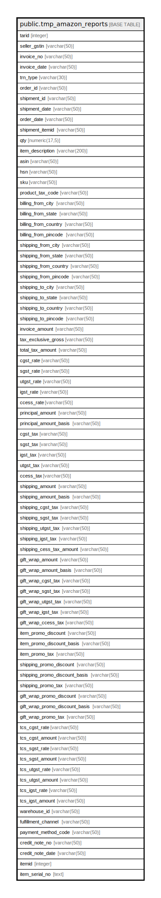

# public.tmp_amazon_reports

## Description

## Columns

| Name | Type | Default | Nullable | Children | Parents | Comment |
| ---- | ---- | ------- | -------- | -------- | ------- | ------- |
| tarid | integer | nextval('tmp_amazon_reports_tarid_seq'::regclass) | false |  |  |  |
| seller_gstin | varchar(50) |  | true |  |  |  |
| invoice_no | varchar(50) |  | true |  |  |  |
| invoice_date | varchar(50) |  | true |  |  |  |
| trn_type | varchar(30) |  | true |  |  |  |
| order_id | varchar(50) |  | true |  |  |  |
| shipment_id | varchar(50) |  | true |  |  |  |
| shipment_date | varchar(50) |  | true |  |  |  |
| order_date | varchar(50) |  | true |  |  |  |
| shipment_itemid | varchar(50) |  | true |  |  |  |
| qty | numeric(17,5) |  | true |  |  |  |
| item_description | varchar(200) |  | true |  |  |  |
| asin | varchar(50) |  | true |  |  |  |
| hsn | varchar(50) |  | true |  |  |  |
| sku | varchar(50) |  | true |  |  |  |
| product_tax_code | varchar(50) |  | true |  |  |  |
| billing_from_city | varchar(50) |  | true |  |  |  |
| billing_from_state | varchar(50) |  | true |  |  |  |
| billing_from_country | varchar(50) |  | true |  |  |  |
| billing_from_pincode | varchar(50) |  | true |  |  |  |
| shipping_from_city | varchar(50) |  | true |  |  |  |
| shipping_from_state | varchar(50) |  | true |  |  |  |
| shipping_from_country | varchar(50) |  | true |  |  |  |
| shipping_from_pincode | varchar(50) |  | true |  |  |  |
| shipping_to_city | varchar(50) |  | true |  |  |  |
| shipping_to_state | varchar(50) |  | true |  |  |  |
| shipping_to_country | varchar(50) |  | true |  |  |  |
| shipping_to_pincode | varchar(50) |  | true |  |  |  |
| invoice_amount | varchar(50) |  | true |  |  |  |
| tax_exclusive_gross | varchar(50) |  | true |  |  |  |
| total_tax_amount | varchar(50) |  | true |  |  |  |
| cgst_rate | varchar(50) |  | true |  |  |  |
| sgst_rate | varchar(50) |  | true |  |  |  |
| utgst_rate | varchar(50) |  | true |  |  |  |
| igst_rate | varchar(50) |  | true |  |  |  |
| ccess_rate | varchar(50) |  | true |  |  |  |
| principal_amount | varchar(50) |  | true |  |  |  |
| principal_amount_basis | varchar(50) |  | true |  |  |  |
| cgst_tax | varchar(50) |  | true |  |  |  |
| sgst_tax | varchar(50) |  | true |  |  |  |
| igst_tax | varchar(50) |  | true |  |  |  |
| utgst_tax | varchar(50) |  | true |  |  |  |
| ccess_tax | varchar(50) |  | true |  |  |  |
| shipping_amount | varchar(50) |  | true |  |  |  |
| shipping_amount_basis | varchar(50) |  | true |  |  |  |
| shipping_cgst_tax | varchar(50) |  | true |  |  |  |
| shipping_sgst_tax | varchar(50) |  | true |  |  |  |
| shipping_utgst_tax | varchar(50) |  | true |  |  |  |
| shipping_igst_tax | varchar(50) |  | true |  |  |  |
| shipping_cess_tax_amount | varchar(50) |  | true |  |  |  |
| gift_wrap_amount | varchar(50) |  | true |  |  |  |
| gift_wrap_amount_basis | varchar(50) |  | true |  |  |  |
| gift_wrap_cgst_tax | varchar(50) |  | true |  |  |  |
| gift_wrap_sgst_tax | varchar(50) |  | true |  |  |  |
| gift_wrap_utgst_tax | varchar(50) |  | true |  |  |  |
| gift_wrap_igst_tax | varchar(50) |  | true |  |  |  |
| gift_wrap_ccess_tax | varchar(50) |  | true |  |  |  |
| item_promo_discount | varchar(50) |  | true |  |  |  |
| item_promo_discount_basis | varchar(50) |  | true |  |  |  |
| item_promo_tax | varchar(50) |  | true |  |  |  |
| shipping_promo_discount | varchar(50) |  | true |  |  |  |
| shipping_promo_discount_basis | varchar(50) |  | true |  |  |  |
| shipping_promo_tax | varchar(50) |  | true |  |  |  |
| gift_wrap_promo_discount | varchar(50) |  | true |  |  |  |
| gift_wrap_promo_discount_basis | varchar(50) |  | true |  |  |  |
| gift_wrap_promo_tax | varchar(50) |  | true |  |  |  |
| tcs_cgst_rate | varchar(50) |  | true |  |  |  |
| tcs_cgst_amount | varchar(50) |  | true |  |  |  |
| tcs_sgst_rate | varchar(50) |  | true |  |  |  |
| tcs_sgst_amount | varchar(50) |  | true |  |  |  |
| tcs_utgst_rate | varchar(50) |  | true |  |  |  |
| tcs_utgst_amount | varchar(50) |  | true |  |  |  |
| tcs_igst_rate | varchar(50) |  | true |  |  |  |
| tcs_igst_amount | varchar(50) |  | true |  |  |  |
| warehouse_id | varchar(50) |  | true |  |  |  |
| fulfillment_channel | varchar(50) |  | true |  |  |  |
| payment_method_code | varchar(50) |  | true |  |  |  |
| credit_note_no | varchar(50) |  | true |  |  |  |
| credit_note_date | varchar(50) |  | true |  |  |  |
| itemid | integer |  | true |  |  |  |
| item_serial_no | text |  | true |  |  |  |

## Relations

---

> Generated by [tbls](https://github.com/k1LoW/tbls)
