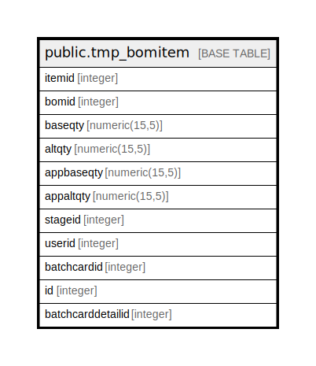

# public.tmp_bomitem

## Description

## Columns

| Name | Type | Default | Nullable | Children | Parents | Comment |
| ---- | ---- | ------- | -------- | -------- | ------- | ------- |
| itemid | integer |  | true |  |  |  |
| bomid | integer |  | true |  |  |  |
| baseqty | numeric(15,5) |  | true |  |  |  |
| altqty | numeric(15,5) |  | true |  |  |  |
| appbaseqty | numeric(15,5) |  | true |  |  |  |
| appaltqty | numeric(15,5) |  | true |  |  |  |
| stageid | integer |  | true |  |  |  |
| userid | integer |  | true |  |  |  |
| batchcardid | integer | 0 | true |  |  |  |
| id | integer |  | true |  |  |  |
| batchcarddetailid | integer |  | true |  |  |  |

## Relations

---

> Generated by [tbls](https://github.com/k1LoW/tbls)
