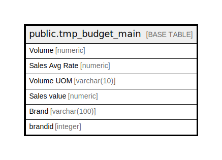

# public.tmp_budget_main

## Description

## Columns

| Name | Type | Default | Nullable | Children | Parents | Comment |
| ---- | ---- | ------- | -------- | -------- | ------- | ------- |
| Volume | numeric |  | true |  |  |  |
| Sales Avg Rate | numeric |  | true |  |  |  |
| Volume UOM | varchar(10) |  | true |  |  |  |
| Sales value | numeric |  | true |  |  |  |
| Brand | varchar(100) |  | true |  |  |  |
| brandid | integer |  | true |  |  |  |

## Relations

---

> Generated by [tbls](https://github.com/k1LoW/tbls)
