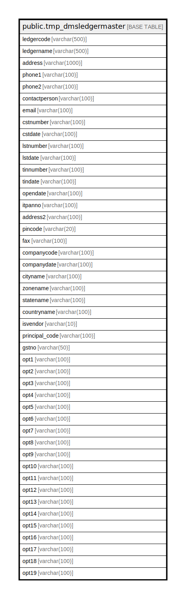

# public.tmp_dmsledgermaster

## Description

## Columns

| Name | Type | Default | Nullable | Children | Parents | Comment |
| ---- | ---- | ------- | -------- | -------- | ------- | ------- |
| ledgercode | varchar(500) |  | true |  |  |  |
| ledgername | varchar(500) |  | true |  |  |  |
| address | varchar(1000) |  | true |  |  |  |
| phone1 | varchar(100) |  | true |  |  |  |
| phone2 | varchar(100) |  | true |  |  |  |
| contactperson | varchar(100) |  | true |  |  |  |
| email | varchar(100) |  | true |  |  |  |
| cstnumber | varchar(100) |  | true |  |  |  |
| cstdate | varchar(100) |  | true |  |  |  |
| lstnumber | varchar(100) |  | true |  |  |  |
| lstdate | varchar(100) |  | true |  |  |  |
| tinnumber | varchar(100) |  | true |  |  |  |
| tindate | varchar(100) |  | true |  |  |  |
| opendate | varchar(100) |  | true |  |  |  |
| itpanno | varchar(100) |  | true |  |  |  |
| address2 | varchar(100) |  | true |  |  |  |
| pincode | varchar(20) |  | true |  |  |  |
| fax | varchar(100) |  | true |  |  |  |
| companycode | varchar(100) |  | true |  |  |  |
| companydate | varchar(100) |  | true |  |  |  |
| cityname | varchar(100) |  | true |  |  |  |
| zonename | varchar(100) |  | true |  |  |  |
| statename | varchar(100) |  | true |  |  |  |
| countryname | varchar(100) |  | true |  |  |  |
| isvendor | varchar(10) |  | true |  |  |  |
| principal_code | varchar(100) |  | true |  |  |  |
| gstno | varchar(50) |  | true |  |  |  |
| opt1 | varchar(100) |  | true |  |  |  |
| opt2 | varchar(100) |  | true |  |  |  |
| opt3 | varchar(100) |  | true |  |  |  |
| opt4 | varchar(100) |  | true |  |  |  |
| opt5 | varchar(100) |  | true |  |  |  |
| opt6 | varchar(100) |  | true |  |  |  |
| opt7 | varchar(100) |  | true |  |  |  |
| opt8 | varchar(100) |  | true |  |  |  |
| opt9 | varchar(100) |  | true |  |  |  |
| opt10 | varchar(100) |  | true |  |  |  |
| opt11 | varchar(100) |  | true |  |  |  |
| opt12 | varchar(100) |  | true |  |  |  |
| opt13 | varchar(100) |  | true |  |  |  |
| opt14 | varchar(100) |  | true |  |  |  |
| opt15 | varchar(100) |  | true |  |  |  |
| opt16 | varchar(100) |  | true |  |  |  |
| opt17 | varchar(100) |  | true |  |  |  |
| opt18 | varchar(100) |  | true |  |  |  |
| opt19 | varchar(100) |  | true |  |  |  |

## Relations

---

> Generated by [tbls](https://github.com/k1LoW/tbls)
