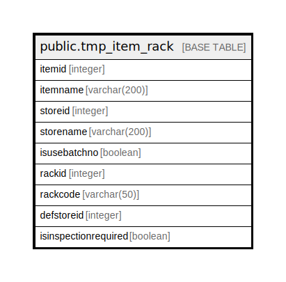

# public.tmp_item_rack

## Description

## Columns

| Name | Type | Default | Nullable | Children | Parents | Comment |
| ---- | ---- | ------- | -------- | -------- | ------- | ------- |
| itemid | integer |  | true |  |  |  |
| itemname | varchar(200) | NULL::character varying | true |  |  |  |
| storeid | integer |  | true |  |  |  |
| storename | varchar(200) | NULL::character varying | true |  |  |  |
| isusebatchno | boolean |  | false |  |  |  |
| rackid | integer |  | true |  |  |  |
| rackcode | varchar(50) | NULL::character varying | true |  |  |  |
| defstoreid | integer |  | true |  |  |  |
| isinspectionrequired | boolean |  | true |  |  |  |

## Relations

---

> Generated by [tbls](https://github.com/k1LoW/tbls)
