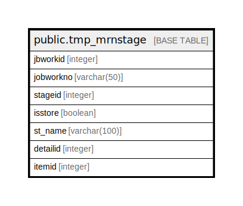

# public.tmp_mrnstage

## Description

## Columns

| Name | Type | Default | Nullable | Children | Parents | Comment |
| ---- | ---- | ------- | -------- | -------- | ------- | ------- |
| jbworkid | integer |  | true |  |  |  |
| jobworkno | varchar(50) |  | true |  |  |  |
| stageid | integer |  | true |  |  |  |
| isstore | boolean |  | true |  |  |  |
| st_name | varchar(100) |  | true |  |  |  |
| detailid | integer |  | true |  |  |  |
| itemid | integer |  | true |  |  |  |

## Relations

---

> Generated by [tbls](https://github.com/k1LoW/tbls)
