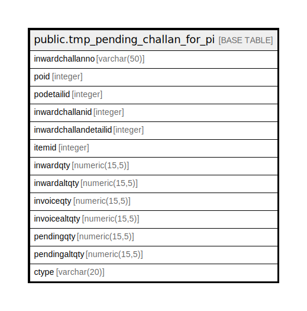

# public.tmp_pending_challan_for_pi

## Description

## Columns

| Name | Type | Default | Nullable | Children | Parents | Comment |
| ---- | ---- | ------- | -------- | -------- | ------- | ------- |
| inwardchallanno | varchar(50) |  | true |  |  |  |
| poid | integer |  | true |  |  |  |
| podetailid | integer |  | true |  |  |  |
| inwardchallanid | integer |  | true |  |  |  |
| inwardchallandetailid | integer |  | true |  |  |  |
| itemid | integer |  | true |  |  |  |
| inwardqty | numeric(15,5) |  | true |  |  |  |
| inwardaltqty | numeric(15,5) |  | true |  |  |  |
| invoiceqty | numeric(15,5) |  | true |  |  |  |
| invoicealtqty | numeric(15,5) |  | true |  |  |  |
| pendingqty | numeric(15,5) |  | true |  |  |  |
| pendingaltqty | numeric(15,5) |  | true |  |  |  |
| ctype | varchar(20) |  | true |  |  |  |

## Relations

---

> Generated by [tbls](https://github.com/k1LoW/tbls)
