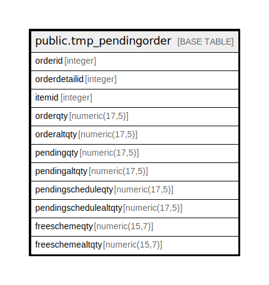

# public.tmp_pendingorder

## Description

## Columns

| Name | Type | Default | Nullable | Children | Parents | Comment |
| ---- | ---- | ------- | -------- | -------- | ------- | ------- |
| orderid | integer |  | true |  |  |  |
| orderdetailid | integer |  | true |  |  |  |
| itemid | integer |  | true |  |  |  |
| orderqty | numeric(17,5) |  | true |  |  |  |
| orderaltqty | numeric(17,5) |  | true |  |  |  |
| pendingqty | numeric(17,5) |  | true |  |  |  |
| pendingaltqty | numeric(17,5) |  | true |  |  |  |
| pendingscheduleqty | numeric(17,5) |  | true |  |  |  |
| pendingschedulealtqty | numeric(17,5) |  | true |  |  |  |
| freeschemeqty | numeric(15,7) |  | true |  |  |  |
| freeschemealtqty | numeric(15,7) |  | true |  |  |  |

## Relations

---

> Generated by [tbls](https://github.com/k1LoW/tbls)
