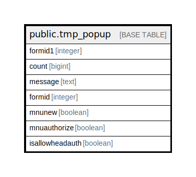

# public.tmp_popup

## Description

## Columns

| Name | Type | Default | Nullable | Children | Parents | Comment |
| ---- | ---- | ------- | -------- | -------- | ------- | ------- |
| formid1 | integer |  | true |  |  |  |
| count | bigint |  | true |  |  |  |
| message | text |  | true |  |  |  |
| formid | integer |  | true |  |  |  |
| mnunew | boolean |  | true |  |  |  |
| mnuauthorize | boolean |  | true |  |  |  |
| isallowheadauth | boolean |  | true |  |  |  |

## Relations

---

> Generated by [tbls](https://github.com/k1LoW/tbls)
