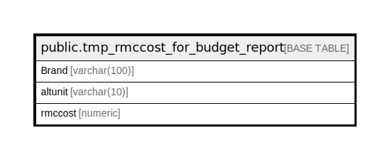

# public.tmp_rmccost_for_budget_report

## Description

## Columns

| Name | Type | Default | Nullable | Children | Parents | Comment |
| ---- | ---- | ------- | -------- | -------- | ------- | ------- |
| Brand | varchar(100) |  | true |  |  |  |
| altunit | varchar(10) |  | true |  |  |  |
| rmccost | numeric |  | true |  |  |  |

## Relations

---

> Generated by [tbls](https://github.com/k1LoW/tbls)
