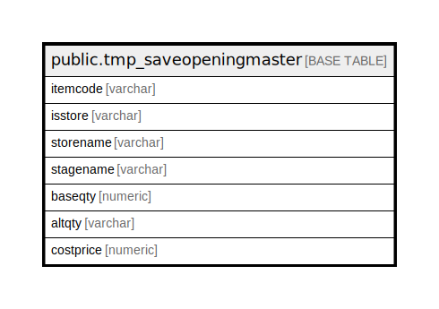

# public.tmp_saveopeningmaster

## Description

## Columns

| Name | Type | Default | Nullable | Children | Parents | Comment |
| ---- | ---- | ------- | -------- | -------- | ------- | ------- |
| itemcode | varchar |  | true |  |  |  |
| isstore | varchar |  | true |  |  |  |
| storename | varchar |  | true |  |  |  |
| stagename | varchar |  | true |  |  |  |
| baseqty | numeric |  | true |  |  |  |
| altqty | varchar |  | true |  |  |  |
| costprice | numeric |  | true |  |  |  |

## Relations

---

> Generated by [tbls](https://github.com/k1LoW/tbls)
