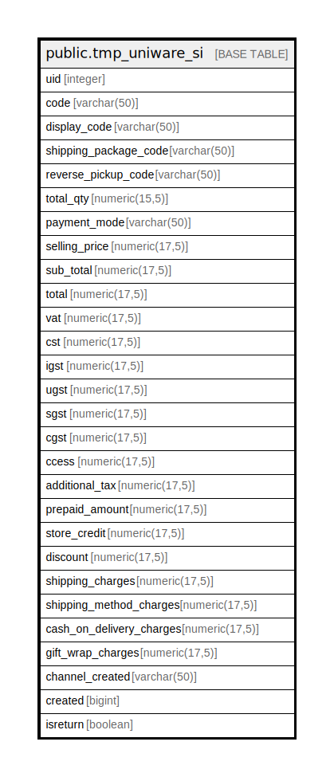

# public.tmp_uniware_si

## Description

## Columns

| Name | Type | Default | Nullable | Children | Parents | Comment |
| ---- | ---- | ------- | -------- | -------- | ------- | ------- |
| uid | integer | nextval('tmp_uniware_si_uid_seq'::regclass) | false |  |  |  |
| code | varchar(50) |  | true |  |  |  |
| display_code | varchar(50) |  | true |  |  |  |
| shipping_package_code | varchar(50) |  | true |  |  |  |
| reverse_pickup_code | varchar(50) |  | true |  |  |  |
| total_qty | numeric(15,5) |  | true |  |  |  |
| payment_mode | varchar(50) |  | true |  |  |  |
| selling_price | numeric(17,5) |  | true |  |  |  |
| sub_total | numeric(17,5) |  | true |  |  |  |
| total | numeric(17,5) |  | true |  |  |  |
| vat | numeric(17,5) |  | true |  |  |  |
| cst | numeric(17,5) |  | true |  |  |  |
| igst | numeric(17,5) |  | true |  |  |  |
| ugst | numeric(17,5) |  | true |  |  |  |
| sgst | numeric(17,5) |  | true |  |  |  |
| cgst | numeric(17,5) |  | true |  |  |  |
| ccess | numeric(17,5) |  | true |  |  |  |
| additional_tax | numeric(17,5) |  | true |  |  |  |
| prepaid_amount | numeric(17,5) |  | true |  |  |  |
| store_credit | numeric(17,5) |  | true |  |  |  |
| discount | numeric(17,5) |  | true |  |  |  |
| shipping_charges | numeric(17,5) |  | true |  |  |  |
| shipping_method_charges | numeric(17,5) |  | true |  |  |  |
| cash_on_delivery_charges | numeric(17,5) |  | true |  |  |  |
| gift_wrap_charges | numeric(17,5) |  | true |  |  |  |
| channel_created | varchar(50) |  | true |  |  |  |
| created | bigint |  | true |  |  |  |
| isreturn | boolean |  | true |  |  |  |

## Constraints

| Name | Type | Definition |
| ---- | ---- | ---------- |
| pk_tmp_uniware_si | PRIMARY KEY | PRIMARY KEY (uid) |

## Indexes

| Name | Definition |
| ---- | ---------- |
| pk_tmp_uniware_si | CREATE UNIQUE INDEX pk_tmp_uniware_si ON public.tmp_uniware_si USING btree (uid) |

## Relations

---

> Generated by [tbls](https://github.com/k1LoW/tbls)
