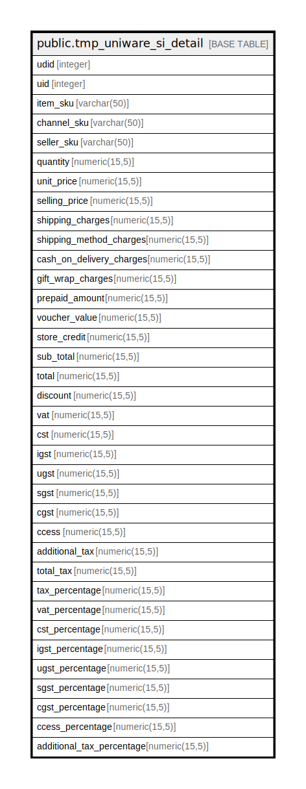

# public.tmp_uniware_si_detail

## Description

## Columns

| Name | Type | Default | Nullable | Children | Parents | Comment |
| ---- | ---- | ------- | -------- | -------- | ------- | ------- |
| udid | integer | nextval('tmp_uniware_si_detail_udid_seq'::regclass) | false |  |  |  |
| uid | integer |  | true |  |  |  |
| item_sku | varchar(50) |  | true |  |  |  |
| channel_sku | varchar(50) |  | true |  |  |  |
| seller_sku | varchar(50) |  | true |  |  |  |
| quantity | numeric(15,5) |  | true |  |  |  |
| unit_price | numeric(15,5) |  | true |  |  |  |
| selling_price | numeric(15,5) |  | true |  |  |  |
| shipping_charges | numeric(15,5) |  | true |  |  |  |
| shipping_method_charges | numeric(15,5) |  | true |  |  |  |
| cash_on_delivery_charges | numeric(15,5) |  | true |  |  |  |
| gift_wrap_charges | numeric(15,5) |  | true |  |  |  |
| prepaid_amount | numeric(15,5) |  | true |  |  |  |
| voucher_value | numeric(15,5) |  | true |  |  |  |
| store_credit | numeric(15,5) |  | true |  |  |  |
| sub_total | numeric(15,5) |  | true |  |  |  |
| total | numeric(15,5) |  | true |  |  |  |
| discount | numeric(15,5) |  | true |  |  |  |
| vat | numeric(15,5) |  | true |  |  |  |
| cst | numeric(15,5) |  | true |  |  |  |
| igst | numeric(15,5) |  | true |  |  |  |
| ugst | numeric(15,5) |  | true |  |  |  |
| sgst | numeric(15,5) |  | true |  |  |  |
| cgst | numeric(15,5) |  | true |  |  |  |
| ccess | numeric(15,5) |  | true |  |  |  |
| additional_tax | numeric(15,5) |  | true |  |  |  |
| total_tax | numeric(15,5) |  | true |  |  |  |
| tax_percentage | numeric(15,5) |  | true |  |  |  |
| vat_percentage | numeric(15,5) |  | true |  |  |  |
| cst_percentage | numeric(15,5) |  | true |  |  |  |
| igst_percentage | numeric(15,5) |  | true |  |  |  |
| ugst_percentage | numeric(15,5) |  | true |  |  |  |
| sgst_percentage | numeric(15,5) |  | true |  |  |  |
| cgst_percentage | numeric(15,5) |  | true |  |  |  |
| ccess_percentage | numeric(15,5) |  | true |  |  |  |
| additional_tax_percentage | numeric(15,5) |  | true |  |  |  |

## Constraints

| Name | Type | Definition |
| ---- | ---- | ---------- |
| pk_tmp_uniware_si_detail | PRIMARY KEY | PRIMARY KEY (udid) |

## Indexes

| Name | Definition |
| ---- | ---------- |
| pk_tmp_uniware_si_detail | CREATE UNIQUE INDEX pk_tmp_uniware_si_detail ON public.tmp_uniware_si_detail USING btree (udid) |

## Relations

---

> Generated by [tbls](https://github.com/k1LoW/tbls)
