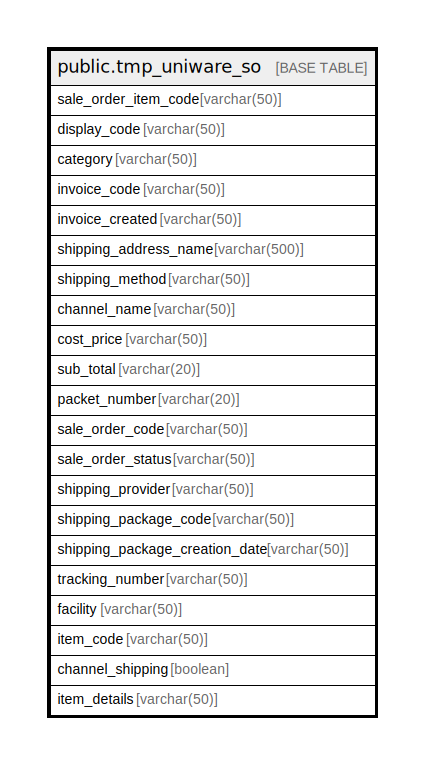

# public.tmp_uniware_so

## Description

## Columns

| Name | Type | Default | Nullable | Children | Parents | Comment |
| ---- | ---- | ------- | -------- | -------- | ------- | ------- |
| sale_order_item_code | varchar(50) |  | true |  |  |  |
| display_code | varchar(50) |  | true |  |  |  |
| category | varchar(50) |  | true |  |  |  |
| invoice_code | varchar(50) |  | true |  |  |  |
| invoice_created | varchar(50) |  | true |  |  |  |
| shipping_address_name | varchar(500) |  | true |  |  |  |
| shipping_method | varchar(50) |  | true |  |  |  |
| channel_name | varchar(50) |  | true |  |  |  |
| cost_price | varchar(50) |  | true |  |  |  |
| sub_total | varchar(20) |  | true |  |  |  |
| packet_number | varchar(20) |  | true |  |  |  |
| sale_order_code | varchar(50) |  | true |  |  |  |
| sale_order_status | varchar(50) |  | true |  |  |  |
| shipping_provider | varchar(50) |  | true |  |  |  |
| shipping_package_code | varchar(50) |  | true |  |  |  |
| shipping_package_creation_date | varchar(50) |  | true |  |  |  |
| tracking_number | varchar(50) |  | true |  |  |  |
| facility | varchar(50) |  | true |  |  |  |
| item_code | varchar(50) |  | true |  |  |  |
| channel_shipping | boolean |  | true |  |  |  |
| item_details | varchar(50) |  | true |  |  |  |

## Relations

---

> Generated by [tbls](https://github.com/k1LoW/tbls)
