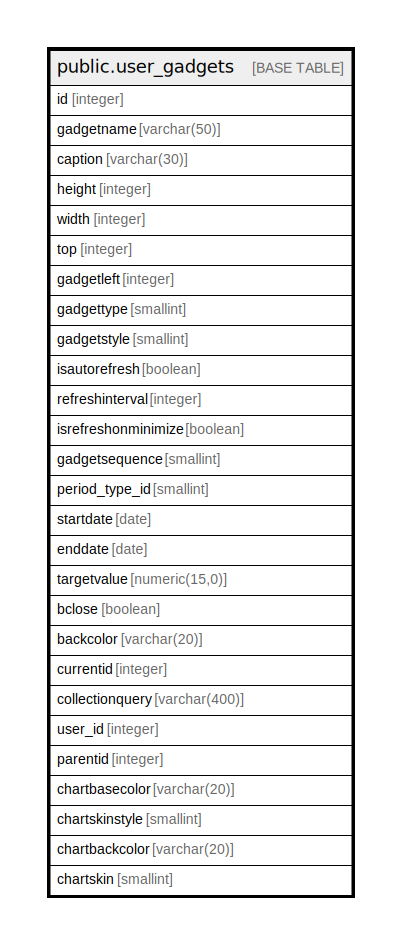

# public.user_gadgets

## Description

## Columns

| Name | Type | Default | Nullable | Children | Parents | Comment |
| ---- | ---- | ------- | -------- | -------- | ------- | ------- |
| id | integer | nextval('user_gadgets_id_seq'::regclass) | false |  |  |  |
| gadgetname | varchar(50) | NULL::character varying | true |  |  |  |
| caption | varchar(30) | NULL::character varying | true |  |  |  |
| height | integer |  | true |  |  |  |
| width | integer |  | true |  |  |  |
| top | integer |  | true |  |  |  |
| gadgetleft | integer |  | true |  |  |  |
| gadgettype | smallint | 1 | true |  |  |  |
| gadgetstyle | smallint | 1 | true |  |  |  |
| isautorefresh | boolean | true | true |  |  |  |
| refreshinterval | integer | 5000 | true |  |  |  |
| isrefreshonminimize | boolean | false | true |  |  |  |
| gadgetsequence | smallint | 0 | true |  |  |  |
| period_type_id | smallint |  | true |  |  |  |
| startdate | date |  | true |  |  |  |
| enddate | date |  | true |  |  |  |
| targetvalue | numeric(15,0) | 0 | true |  |  |  |
| bclose | boolean | true | true |  |  |  |
| backcolor | varchar(20) | NULL::character varying | true |  |  |  |
| currentid | integer |  | true |  |  |  |
| collectionquery | varchar(400) | NULL::character varying | true |  |  |  |
| user_id | integer |  | true |  |  |  |
| parentid | integer |  | true |  |  |  |
| chartbasecolor | varchar(20) | NULL::character varying | true |  |  |  |
| chartskinstyle | smallint |  | true |  |  |  |
| chartbackcolor | varchar(20) | NULL::character varying | true |  |  |  |
| chartskin | smallint |  | true |  |  |  |

## Constraints

| Name | Type | Definition |
| ---- | ---- | ---------- |
| user_gadgets_pkey | PRIMARY KEY | PRIMARY KEY (id) |

## Indexes

| Name | Definition |
| ---- | ---------- |
| user_gadgets_pkey | CREATE UNIQUE INDEX user_gadgets_pkey ON public.user_gadgets USING btree (id) |

## Relations

---

> Generated by [tbls](https://github.com/k1LoW/tbls)
