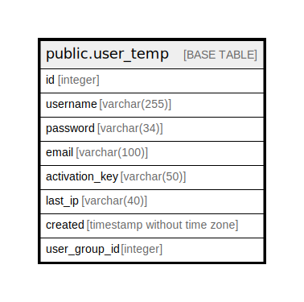

# public.user_temp

## Description

## Columns

| Name | Type | Default | Nullable | Children | Parents | Comment |
| ---- | ---- | ------- | -------- | -------- | ------- | ------- |
| id | integer |  | false |  |  |  |
| username | varchar(255) | NULL::character varying | true |  |  |  |
| password | varchar(34) | NULL::character varying | true |  |  |  |
| email | varchar(100) | NULL::character varying | true |  |  |  |
| activation_key | varchar(50) | NULL::character varying | true |  |  |  |
| last_ip | varchar(40) | NULL::character varying | true |  |  |  |
| created | timestamp without time zone | '2010-09-22 16:58:16.105'::timestamp without time zone | true |  |  |  |
| user_group_id | integer |  | false |  |  |  |

## Constraints

| Name | Type | Definition |
| ---- | ---- | ---------- |
| user_temp_pkey | PRIMARY KEY | PRIMARY KEY (id) |

## Indexes

| Name | Definition |
| ---- | ---------- |
| user_temp_pkey | CREATE UNIQUE INDEX user_temp_pkey ON public.user_temp USING btree (id) |

## Relations

---

> Generated by [tbls](https://github.com/k1LoW/tbls)
