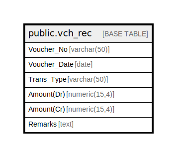

# public.vch_rec

## Description

## Columns

| Name | Type | Default | Nullable | Children | Parents | Comment |
| ---- | ---- | ------- | -------- | -------- | ------- | ------- |
| Voucher_No | varchar(50) |  | true |  |  |  |
| Voucher_Date | date |  | true |  |  |  |
| Trans_Type | varchar(50) |  | true |  |  |  |
| Amount(Dr) | numeric(15,4) |  | true |  |  |  |
| Amount(Cr) | numeric(15,4) |  | true |  |  |  |
| Remarks | text |  | true |  |  |  |

## Relations

---

> Generated by [tbls](https://github.com/k1LoW/tbls)
