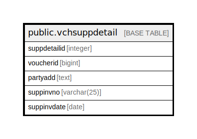

# public.vchsuppdetail

## Description

## Columns

| Name | Type | Default | Nullable | Children | Parents | Comment |
| ---- | ---- | ------- | -------- | -------- | ------- | ------- |
| suppdetailid | integer | nextval('vchsuppdetail_suppdetailid_seq'::regclass) | false |  |  |  |
| voucherid | bigint |  | true |  |  |  |
| partyadd | text |  | false |  |  |  |
| suppinvno | varchar(25) |  | true |  |  |  |
| suppinvdate | date |  | true |  |  |  |

## Constraints

| Name | Type | Definition |
| ---- | ---- | ---------- |
| vchsuppdetail_pkey | PRIMARY KEY | PRIMARY KEY (suppdetailid, partyadd) |

## Indexes

| Name | Definition |
| ---- | ---------- |
| vchsuppdetail_pkey | CREATE UNIQUE INDEX vchsuppdetail_pkey ON public.vchsuppdetail USING btree (suppdetailid, partyadd) |

## Relations

---

> Generated by [tbls](https://github.com/k1LoW/tbls)
