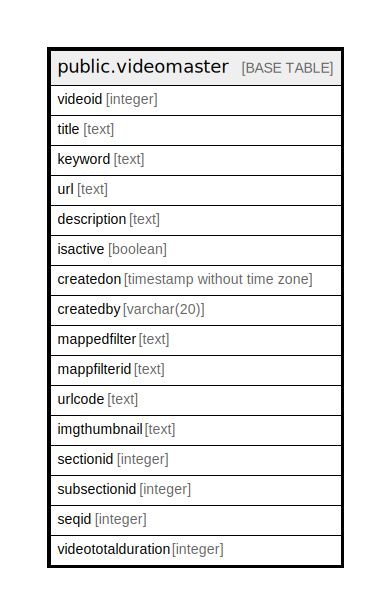

# public.videomaster

## Description

## Columns

| Name | Type | Default | Nullable | Children | Parents | Comment |
| ---- | ---- | ------- | -------- | -------- | ------- | ------- |
| videoid | integer | nextval('videomaster_videoid_seq'::regclass) | false |  |  |  |
| title | text |  | true |  |  |  |
| keyword | text |  | true |  |  |  |
| url | text |  | true |  |  |  |
| description | text |  | true |  |  |  |
| isactive | boolean | true | true |  |  |  |
| createdon | timestamp without time zone | now() | true |  |  |  |
| createdby | varchar(20) |  | true |  |  |  |
| mappedfilter | text |  | true |  |  |  |
| mappfilterid | text |  | true |  |  |  |
| urlcode | text |  | true |  |  |  |
| imgthumbnail | text |  | true |  |  |  |
| sectionid | integer |  | true |  |  |  |
| subsectionid | integer |  | true |  |  |  |
| seqid | integer |  | true |  |  |  |
| videototalduration | integer |  | true |  |  |  |

## Relations

---

> Generated by [tbls](https://github.com/k1LoW/tbls)
