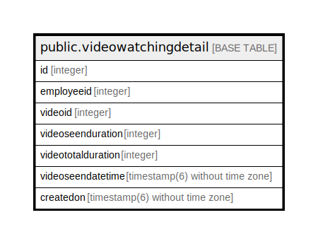

# public.videowatchingdetail

## Description

## Columns

| Name | Type | Default | Nullable | Children | Parents | Comment |
| ---- | ---- | ------- | -------- | -------- | ------- | ------- |
| id | integer | nextval('videowatchingdetail_id_seq'::regclass) | false |  |  |  |
| employeeid | integer |  | true |  |  |  |
| videoid | integer |  | true |  |  |  |
| videoseenduration | integer |  | true |  |  |  |
| videototalduration | integer |  | true |  |  |  |
| videoseendatetime | timestamp(6) without time zone |  | true |  |  |  |
| createdon | timestamp(6) without time zone | now() | true |  |  |  |

## Constraints

| Name | Type | Definition |
| ---- | ---- | ---------- |
| videowatchingdetail_pkey | PRIMARY KEY | PRIMARY KEY (id) |

## Indexes

| Name | Definition |
| ---- | ---------- |
| videowatchingdetail_pkey | CREATE UNIQUE INDEX videowatchingdetail_pkey ON public.videowatchingdetail USING btree (id) |

## Relations

---

> Generated by [tbls](https://github.com/k1LoW/tbls)
