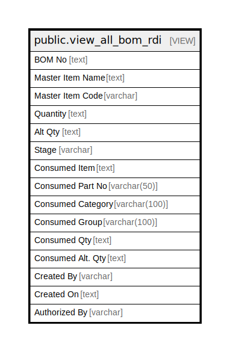

# public.view_all_bom_rdi

## Description

<details>
<summary><strong>Table Definition</strong></summary>

```sql
CREATE VIEW view_all_bom_rdi AS (
 SELECT
        CASE
            WHEN (bomd.bomdetailid = refbomd.minbomdetailid) THEN (bom.bomno)::text
            ELSE ''::text
        END AS "BOM No",
        CASE
            WHEN (bomd.bomdetailid = refbomd.minbomdetailid) THEN item.itemname
            ELSE ''::text
        END AS "Master Item Name",
        CASE
            WHEN (bomd.bomdetailid = refbomd.minbomdetailid) THEN item.itemcode
            ELSE ''::character varying
        END AS "Master Item Code",
        CASE
            WHEN (bomd.bomdetailid = refbomd.minbomdetailid) THEN ((round(bom.baseqty, (item.basedecimalplaces)::integer) || ' '::text) || (item.baseunit)::text)
            ELSE ''::text
        END AS "Quantity",
        CASE
            WHEN (bomd.bomdetailid = refbomd.minbomdetailid) THEN ((round(bom.altqty, (item.altdecimalplaces)::integer) || ' '::text) || (item.altunit)::text)
            ELSE ''::text
        END AS "Alt Qty",
        CASE
            WHEN (bomd.bomdetailid = refbomd.minbomdetailid) THEN astage.stage
            ELSE ''::character varying
        END AS "Stage",
    itm.itemname AS "Consumed Item",
    itm.itemcode AS "Consumed Part No",
    itm.itemcategoryname AS "Consumed Category",
    itm.groupname AS "Consumed Group",
    ((round(bomd.baseqty, (itm.basedecimalplaces)::integer) || ' '::text) || (itm.baseunit)::text) AS "Consumed Qty",
    ((round(bomd.altqty, (itm.altdecimalplaces)::integer) || ' '::text) || (itm.altunit)::text) AS "Consumed Alt. Qty",
        CASE
            WHEN (bomd.bomdetailid = refbomd.minbomdetailid) THEN cremp.employeename
            ELSE ''::character varying
        END AS "Created By",
        CASE
            WHEN (bomd.bomdetailid = refbomd.minbomdetailid) THEN (bom.createdon)::text
            ELSE ''::text
        END AS "Created On",
        CASE
            WHEN (bomd.bomdetailid = refbomd.minbomdetailid) THEN authemp.employeename
            ELSE ''::character varying
        END AS "Authorized By"
   FROM (((((((prod_bom bom
     JOIN prod_stagemaster astage ON ((astage.stageid = bom.stageid)))
     JOIN view_item_normal item ON (((bom.itemid = item.itemid) AND (((bom.isactive = true) AND (bom.stageid <> '-1'::integer) AND (COALESCE(bom.isjobworkbom, false) = false)) OR ((bom.stageid = '-1'::integer) AND (COALESCE(bom.isjobworkbom, false) = false)) OR ((bom.stageid <> '-1'::integer) AND (COALESCE(bom.isjobworkbom, false) = true))) AND (bom.isauthorized = true))))
     JOIN prod_bomitemdetail bomd ON ((bomd.bomid = bom.bomid)))
     JOIN view_item_normal itm ON ((bomd.itemid = itm.itemid)))
     LEFT JOIN view_userdetail cremp ON ((bom.createdby = cremp.userid)))
     LEFT JOIN view_userdetail authemp ON ((bom.authorizedby = authemp.userid)))
     LEFT JOIN ( SELECT min(pbomd.bomdetailid) AS minbomdetailid,
            pbomd.bomid
           FROM (prod_bomitemdetail pbomd
             JOIN prod_bom pbom ON ((pbom.bomid = pbomd.bomid)))
          WHERE (pbom.isactive = true)
          GROUP BY pbomd.bomid
          ORDER BY pbomd.bomid) refbomd ON ((refbomd.minbomdetailid = bomd.bomdetailid)))
  ORDER BY bom.bomno, bomd.bomdetailid
)
```

</details>

## Columns

| Name | Type | Default | Nullable | Children | Parents | Comment |
| ---- | ---- | ------- | -------- | -------- | ------- | ------- |
| BOM No | text |  | true |  |  |  |
| Master Item Name | text |  | true |  |  |  |
| Master Item Code | varchar |  | true |  |  |  |
| Quantity | text |  | true |  |  |  |
| Alt Qty | text |  | true |  |  |  |
| Stage | varchar |  | true |  |  |  |
| Consumed Item | text |  | true |  |  |  |
| Consumed Part No | varchar(50) |  | true |  |  |  |
| Consumed Category | varchar(100) |  | true |  |  |  |
| Consumed Group | varchar(100) |  | true |  |  |  |
| Consumed Qty | text |  | true |  |  |  |
| Consumed Alt. Qty | text |  | true |  |  |  |
| Created By | varchar |  | true |  |  |  |
| Created On | text |  | true |  |  |  |
| Authorized By | varchar |  | true |  |  |  |

## Referenced Tables

| Name | Columns | Comment | Type |
| ---- | ------- | ------- | ---- |
| [public.prod_bom](public.prod_bom.md) | 34 |  | BASE TABLE |
| [public.prod_stagemaster](public.prod_stagemaster.md) | 17 |  | BASE TABLE |
| [public.view_item_normal](public.view_item_normal.md) | 91 |  | VIEW |
| [public.prod_bomitemdetail](public.prod_bomitemdetail.md) | 31 |  | BASE TABLE |
| [public.view_userdetail](public.view_userdetail.md) | 7 |  | VIEW |

## Relations



---

> Generated by [tbls](https://github.com/k1LoW/tbls)
