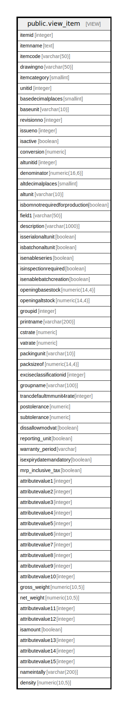

# public.view_item

## Description

<details>
<summary><strong>Table Definition</strong></summary>

```sql
CREATE VIEW view_item AS (
 SELECT itm.itemid,
        CASE
            WHEN (COALESCE(itm.isactive, false) = false) THEN ('[INACTIVE] '::text || (itm.itemname)::text)
            ELSE (
            CASE
                WHEN (COALESCE(itm.isauthorized, false) = false) THEN '[UNAUTHORIZED] '::text
                ELSE ''::text
            END || (itm.itemname)::text)
        END AS itemname,
    itm.itemcode,
    itm.drawingno,
    itm.itemcategory,
    itm.unitid,
    bunit.noofdecimalplace AS basedecimalplaces,
    bunit.shortname AS baseunit,
    itm.revisionno,
    itm.issueno,
    itm.isactive,
    COALESCE(itm.conversion, (0)::numeric) AS conversion,
    itm.altunitid,
    itm.denominator,
    aunit.noofdecimalplace AS altdecimalplaces,
    aunit.shortname AS altunit,
    itm.isbomnotrequiredforproduction,
    itm.field1,
    itm.description,
    COALESCE(itm.isserialonaltunit, false) AS isserialonaltunit,
    COALESCE(itm.isbatchonaltunit, false) AS isbatchonaltunit,
        CASE
            WHEN (itm.isenableseries IS NULL) THEN false
            ELSE itm.isenableseries
        END AS isenableseries,
    itm.isinspectionrequired,
    itm.isenablebatchcreation,
    itm.openingbasestock,
    itm.openingaltstock,
    itm.groupid,
    itm.printname,
    COALESCE(itm.cstrate, (0)::numeric) AS cstrate,
    COALESCE(itm.vatrate, (0)::numeric) AS vatrate,
    pack.shortname AS packingunit,
    itm.packsizeof,
    itm.exciseclassificationid,
    stor_itemgroup.groupname,
    COALESCE((itm.trancdefaultmmunit4rate)::integer, 0) AS trancdefaultmmunit4rate,
    COALESCE(itm.postolerance, 0.0) AS postolerance,
    COALESCE(itm.subtolerance, 0.0) AS subtolerance,
    COALESCE(itm.dissallowmodvat, false) AS dissallowmodvat,
    itm.reporting_unit,
    itm.warranty_period,
    COALESCE(itm.isexpirydatemandatory, false) AS isexpirydatemandatory,
    itm.mrp_inclusive_tax,
    itm.attributevalue1,
    itm.attributevalue2,
    itm.attributevalue3,
    itm.attributevalue4,
    itm.attributevalue5,
    itm.attributevalue6,
    itm.attributevalue7,
    itm.attributevalue8,
    itm.attributevalue9,
    itm.attributevalue10,
    itm.gross_weight,
    itm.net_weight,
    itm.attributevalue11,
    itm.attributevalue12,
    itm.isamount,
    itm.attributevalue13,
    itm.attributevalue14,
    itm.attributevalue15,
    COALESCE(itm.nameintally, itm.printname) AS nameintally,
    itm.density
   FROM ((((stor_itemmaster itm
     LEFT JOIN stor_measurementunit bunit ON ((itm.unitid = bunit.unitid)))
     LEFT JOIN stor_measurementunit aunit ON ((itm.altunitid = aunit.unitid)))
     LEFT JOIN stor_measurementunit pack ON ((itm.packinguomid = pack.unitid)))
     LEFT JOIN stor_itemgroup ON ((itm.groupid = stor_itemgroup.groupid)))
)
```

</details>

## Columns

| Name | Type | Default | Nullable | Children | Parents | Comment |
| ---- | ---- | ------- | -------- | -------- | ------- | ------- |
| itemid | integer |  | true |  |  |  |
| itemname | text |  | true |  |  |  |
| itemcode | varchar(50) |  | true |  |  |  |
| drawingno | varchar(50) |  | true |  |  |  |
| itemcategory | smallint |  | true |  |  |  |
| unitid | integer |  | true |  |  |  |
| basedecimalplaces | smallint |  | true |  |  |  |
| baseunit | varchar(10) |  | true |  |  |  |
| revisionno | integer |  | true |  |  |  |
| issueno | integer |  | true |  |  |  |
| isactive | boolean |  | true |  |  |  |
| conversion | numeric |  | true |  |  |  |
| altunitid | integer |  | true |  |  |  |
| denominator | numeric(16,6) |  | true |  |  |  |
| altdecimalplaces | smallint |  | true |  |  |  |
| altunit | varchar(10) |  | true |  |  |  |
| isbomnotrequiredforproduction | boolean |  | true |  |  |  |
| field1 | varchar(50) |  | true |  |  |  |
| description | varchar(1000) |  | true |  |  |  |
| isserialonaltunit | boolean |  | true |  |  |  |
| isbatchonaltunit | boolean |  | true |  |  |  |
| isenableseries | boolean |  | true |  |  |  |
| isinspectionrequired | boolean |  | true |  |  |  |
| isenablebatchcreation | boolean |  | true |  |  |  |
| openingbasestock | numeric(14,4) |  | true |  |  |  |
| openingaltstock | numeric(14,4) |  | true |  |  |  |
| groupid | integer |  | true |  |  |  |
| printname | varchar(200) |  | true |  |  |  |
| cstrate | numeric |  | true |  |  |  |
| vatrate | numeric |  | true |  |  |  |
| packingunit | varchar(10) |  | true |  |  |  |
| packsizeof | numeric(14,4) |  | true |  |  |  |
| exciseclassificationid | integer |  | true |  |  |  |
| groupname | varchar(100) |  | true |  |  |  |
| trancdefaultmmunit4rate | integer |  | true |  |  |  |
| postolerance | numeric |  | true |  |  |  |
| subtolerance | numeric |  | true |  |  |  |
| dissallowmodvat | boolean |  | true |  |  |  |
| reporting_unit | boolean |  | true |  |  |  |
| warranty_period | varchar |  | true |  |  |  |
| isexpirydatemandatory | boolean |  | true |  |  |  |
| mrp_inclusive_tax | boolean |  | true |  |  |  |
| attributevalue1 | integer |  | true |  |  |  |
| attributevalue2 | integer |  | true |  |  |  |
| attributevalue3 | integer |  | true |  |  |  |
| attributevalue4 | integer |  | true |  |  |  |
| attributevalue5 | integer |  | true |  |  |  |
| attributevalue6 | integer |  | true |  |  |  |
| attributevalue7 | integer |  | true |  |  |  |
| attributevalue8 | integer |  | true |  |  |  |
| attributevalue9 | integer |  | true |  |  |  |
| attributevalue10 | integer |  | true |  |  |  |
| gross_weight | numeric(10,5) |  | true |  |  |  |
| net_weight | numeric(10,5) |  | true |  |  |  |
| attributevalue11 | integer |  | true |  |  |  |
| attributevalue12 | integer |  | true |  |  |  |
| isamount | boolean |  | true |  |  |  |
| attributevalue13 | integer |  | true |  |  |  |
| attributevalue14 | integer |  | true |  |  |  |
| attributevalue15 | integer |  | true |  |  |  |
| nameintally | varchar(200) |  | true |  |  |  |
| density | numeric(10,5) |  | true |  |  |  |

## Referenced Tables

| Name | Columns | Comment | Type |
| ---- | ------- | ------- | ---- |
| [public.stor_itemmaster](public.stor_itemmaster.md) | 178 |  | BASE TABLE |
| [public.stor_measurementunit](public.stor_measurementunit.md) | 25 |  | BASE TABLE |
| [public.stor_itemgroup](public.stor_itemgroup.md) | 36 |  | BASE TABLE |

## Relations



---

> Generated by [tbls](https://github.com/k1LoW/tbls)
