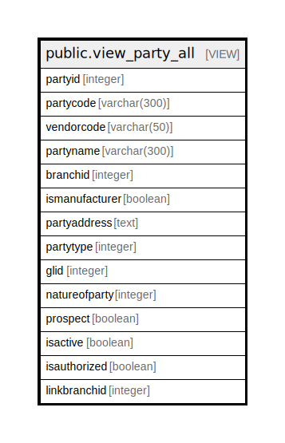

# public.view_party_all

## Description

<details>
<summary><strong>Table Definition</strong></summary>

```sql
CREATE VIEW view_party_all AS (
 SELECT pm.partyid,
    pm.partycode,
    pm.vendorcode,
    pm.partyname,
    pb.branchid,
    pm.ismanufacturer,
    ((((COALESCE(((pm.address)::text || chr(13)), ''::text) || COALESCE(((','::text || (cm.cityname)::text) || chr(13)), ''::text)) || COALESCE((','::text || (sm.statename)::text), (''::character varying)::text)) || COALESCE((','::text || (cmm.countryname)::text), (''::character varying)::text)) || COALESCE((','::text || (pm.pincode)::text), (''::character varying)::text)) AS partyaddress,
    pm.partytype,
    pm.glid,
    pm.natureofparty,
    pm.prospect,
    pm.isactive,
    pm.isauthorized,
    pm.linkbranchid
   FROM ((((comn_partymaster pm
     LEFT JOIN comn_citymaster cm ON (((pm.cityid = cm.cityid) AND ((cm.cityname)::text <> 'None'::text))))
     LEFT JOIN comn_statemaster sm ON (((pm.stateid = sm.stateid) AND ((sm.statename)::text <> 'None'::text))))
     LEFT JOIN comn_countrymaster cmm ON (((pm.countryid = cmm.countryid) AND ((cmm.countryname)::text <> 'None'::text))))
     LEFT JOIN ( SELECT DISTINCT comn_partybelongstobranch.branchid,
            comn_partybelongstobranch.partyid
           FROM comn_partybelongstobranch
          WHERE (comn_partybelongstobranch.isactive = true)
          ORDER BY comn_partybelongstobranch.branchid, comn_partybelongstobranch.partyid) pb ON ((pb.partyid = pm.partyid)))
)
```

</details>

## Columns

| Name | Type | Default | Nullable | Children | Parents | Comment |
| ---- | ---- | ------- | -------- | -------- | ------- | ------- |
| partyid | integer |  | true |  |  |  |
| partycode | varchar(300) |  | true |  |  |  |
| vendorcode | varchar(50) |  | true |  |  |  |
| partyname | varchar(300) |  | true |  |  |  |
| branchid | integer |  | true |  |  |  |
| ismanufacturer | boolean |  | true |  |  |  |
| partyaddress | text |  | true |  |  |  |
| partytype | integer |  | true |  |  |  |
| glid | integer |  | true |  |  |  |
| natureofparty | integer |  | true |  |  |  |
| prospect | boolean |  | true |  |  |  |
| isactive | boolean |  | true |  |  |  |
| isauthorized | boolean |  | true |  |  |  |
| linkbranchid | integer |  | true |  |  |  |

## Referenced Tables

| Name | Columns | Comment | Type |
| ---- | ------- | ------- | ---- |
| [public.comn_partymaster](public.comn_partymaster.md) | 120 |  | BASE TABLE |
| [public.comn_citymaster](public.comn_citymaster.md) | 13 |  | BASE TABLE |
| [public.comn_statemaster](public.comn_statemaster.md) | 14 |  | BASE TABLE |
| [public.comn_countrymaster](public.comn_countrymaster.md) | 12 |  | BASE TABLE |
| [public.comn_partybelongstobranch](public.comn_partybelongstobranch.md) | 13 |  | BASE TABLE |

## Relations



---

> Generated by [tbls](https://github.com/k1LoW/tbls)
