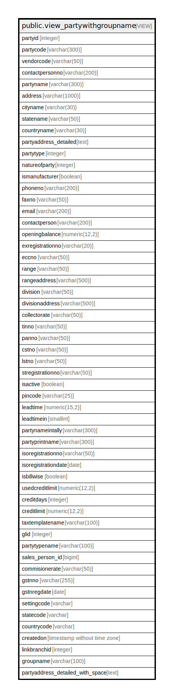

# public.view_partywithgroupname

## Description

<details>
<summary><strong>Table Definition</strong></summary>

```sql
CREATE VIEW view_partywithgroupname AS (
 SELECT pm.partyid,
    pm.partycode,
    pm.vendorcode,
    pm.contactpersonno,
    pm.partyname,
    pm.address,
    cm.cityname,
    sm.statename,
    cmm.countryname,
    (((COALESCE(((pm.address)::text || chr(13)), ''::text) || COALESCE(((','::text || (cm.cityname)::text) || chr(13)), ''::text)) || COALESCE((','::text || (sm.statename)::text), (''::character varying)::text)) || COALESCE((','::text || (cmm.countryname)::text), (''::character varying)::text)) AS partyaddress_detailed,
    pm.partytype,
    pm.natureofparty,
    pm.ismanufacturer,
    pm.phoneno,
    pm.faxno,
    pm.email,
    pm.contactperson,
    pm.openingbalance,
    pm.exregistrationno,
    pm.eccno,
    pm.range,
    pm.rangeaddress,
    pm.division,
    pm.divisionaddress,
    pm.collectorate,
    pm.tinno,
    pm.panno,
    pm.cstno,
    pm.lstno,
    pm.stregistrationno,
    pm.isactive,
    pm.pincode,
    pm.leadtime,
    pm.leadtimein,
    pm.partynameintally,
    pm.partyprintname,
    pm.isoregistrationno,
    pm.isoregistrationdate,
    pm.isbillwise,
    pm.usedcreditlimit,
    pm.creditdays,
    pm.creditlimit,
    tax.taxtemplatename,
    pm.glid,
    svm.valuename AS partytypename,
    pm.sales_person_id,
    pm.commisionerate,
    pm.gstnno,
    pm.gstnregdate,
    svm1.settingcode,
    svm1.settingcode AS statecode,
    cmm.code AS countrycode,
    pm.createdon,
    pm.linkbranchid,
    pgr.groupname,
    (((COALESCE(((pm.address)::text || chr(13)), ''::text) || COALESCE(((' '::text || (cm.cityname)::text) || chr(13)), ''::text)) || COALESCE((' '::text || (sm.statename)::text), (''::character varying)::text)) || COALESCE((' '::text || (cmm.countryname)::text), (''::character varying)::text)) AS partyaddress_detailed_with_space
   FROM (((((((comn_partymaster pm
     LEFT JOIN settingvaluemaster svm ON (((svm.settingvalueid = pm.natureofparty) AND (svm.settingid = 26))))
     LEFT JOIN acc_taxtemplate tax ON ((tax.taxtemplateid = pm.taxtemplateid)))
     LEFT JOIN comn_citymaster cm ON (((pm.cityid = cm.cityid) AND ((cm.cityname)::text <> 'None'::text))))
     LEFT JOIN comn_statemaster sm ON (((pm.stateid = sm.stateid) AND ((sm.statename)::text <> 'None'::text))))
     LEFT JOIN settingvaluemaster svm1 ON (((svm1.settingvalueid = sm.gststatecodeid) AND (svm1.settingid = 100))))
     LEFT JOIN comn_partygroup pgr ON ((pgr.groupid = pm.groupid)))
     LEFT JOIN comn_countrymaster cmm ON (((pm.countryid = cmm.countryid) AND ((cmm.countryname)::text <> 'None'::text))))
)
```

</details>

## Columns

| Name | Type | Default | Nullable | Children | Parents | Comment |
| ---- | ---- | ------- | -------- | -------- | ------- | ------- |
| partyid | integer |  | true |  |  |  |
| partycode | varchar(300) |  | true |  |  |  |
| vendorcode | varchar(50) |  | true |  |  |  |
| contactpersonno | varchar(200) |  | true |  |  |  |
| partyname | varchar(300) |  | true |  |  |  |
| address | varchar(1000) |  | true |  |  |  |
| cityname | varchar(30) |  | true |  |  |  |
| statename | varchar(50) |  | true |  |  |  |
| countryname | varchar(30) |  | true |  |  |  |
| partyaddress_detailed | text |  | true |  |  |  |
| partytype | integer |  | true |  |  |  |
| natureofparty | integer |  | true |  |  |  |
| ismanufacturer | boolean |  | true |  |  |  |
| phoneno | varchar(200) |  | true |  |  |  |
| faxno | varchar(50) |  | true |  |  |  |
| email | varchar(200) |  | true |  |  |  |
| contactperson | varchar(200) |  | true |  |  |  |
| openingbalance | numeric(12,2) |  | true |  |  |  |
| exregistrationno | varchar(20) |  | true |  |  |  |
| eccno | varchar(50) |  | true |  |  |  |
| range | varchar(50) |  | true |  |  |  |
| rangeaddress | varchar(500) |  | true |  |  |  |
| division | varchar(50) |  | true |  |  |  |
| divisionaddress | varchar(500) |  | true |  |  |  |
| collectorate | varchar(50) |  | true |  |  |  |
| tinno | varchar(50) |  | true |  |  |  |
| panno | varchar(50) |  | true |  |  |  |
| cstno | varchar(50) |  | true |  |  |  |
| lstno | varchar(50) |  | true |  |  |  |
| stregistrationno | varchar(50) |  | true |  |  |  |
| isactive | boolean |  | true |  |  |  |
| pincode | varchar(25) |  | true |  |  |  |
| leadtime | numeric(15,2) |  | true |  |  |  |
| leadtimein | smallint |  | true |  |  |  |
| partynameintally | varchar(300) |  | true |  |  |  |
| partyprintname | varchar(300) |  | true |  |  |  |
| isoregistrationno | varchar(50) |  | true |  |  |  |
| isoregistrationdate | date |  | true |  |  |  |
| isbillwise | boolean |  | true |  |  |  |
| usedcreditlimit | numeric(12,2) |  | true |  |  |  |
| creditdays | integer |  | true |  |  |  |
| creditlimit | numeric(12,2) |  | true |  |  |  |
| taxtemplatename | varchar(100) |  | true |  |  |  |
| glid | integer |  | true |  |  |  |
| partytypename | varchar(100) |  | true |  |  |  |
| sales_person_id | bigint |  | true |  |  |  |
| commisionerate | varchar(50) |  | true |  |  |  |
| gstnno | varchar(255) |  | true |  |  |  |
| gstnregdate | date |  | true |  |  |  |
| settingcode | varchar |  | true |  |  |  |
| statecode | varchar |  | true |  |  |  |
| countrycode | varchar |  | true |  |  |  |
| createdon | timestamp without time zone |  | true |  |  |  |
| linkbranchid | integer |  | true |  |  |  |
| groupname | varchar(100) |  | true |  |  |  |
| partyaddress_detailed_with_space | text |  | true |  |  |  |

## Referenced Tables

| Name | Columns | Comment | Type |
| ---- | ------- | ------- | ---- |
| [public.comn_partymaster](public.comn_partymaster.md) | 120 |  | BASE TABLE |
| [public.settingvaluemaster](public.settingvaluemaster.md) | 6 |  | BASE TABLE |
| [public.acc_taxtemplate](public.acc_taxtemplate.md) | 20 |  | BASE TABLE |
| [public.comn_citymaster](public.comn_citymaster.md) | 13 |  | BASE TABLE |
| [public.comn_statemaster](public.comn_statemaster.md) | 14 |  | BASE TABLE |
| [public.comn_partygroup](public.comn_partygroup.md) | 19 |  | BASE TABLE |
| [public.comn_countrymaster](public.comn_countrymaster.md) | 12 |  | BASE TABLE |

## Relations



---

> Generated by [tbls](https://github.com/k1LoW/tbls)
