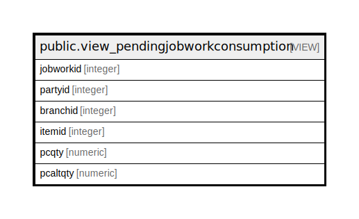

# public.view_pendingjobworkconsumption

## Description

<details>
<summary><strong>Table Definition</strong></summary>

```sql
CREATE VIEW view_pendingjobworkconsumption AS (
 SELECT jwc.jobworkid,
    jw.partyid,
    jw.branchid,
    jwc.itemid,
    ((((COALESCE(jwc.consumedbaseqty, (0)::numeric) + COALESCE(jwc.adjustmentbaseqty, (0)::numeric)) - sum(COALESCE(jwc.oldconsumedbaseqty, (0)::numeric))) - sum(COALESCE(totalconsume.qty, (0)::numeric))) - sum(COALESCE(senditemreceived.baseqty, (0)::numeric))) AS pcqty,
    ((((COALESCE(jwc.consumedaltqty, (0)::numeric) + COALESCE(jwc.adjustmentaltqty, (0)::numeric)) - sum(COALESCE(jwc.oldconsumedaltqty, (0)::numeric))) - sum(COALESCE(totalconsume.altqty, (0)::numeric))) - sum(COALESCE(senditemreceived.altqty, (0)::numeric))) AS pcaltqty
   FROM (((((prod_itemjobworkconsumption jwc
     JOIN prod_itemjobwork jw ON (((jw.jobworkid = jwc.jobworkid) AND (jw.isauthorized = true))))
     JOIN view_party vp ON ((jw.partyid = vp.partyid)))
     JOIN stor_itemmaster itm ON ((jwc.itemid = itm.itemid)))
     LEFT JOIN ( SELECT consume.poid,
            consume.itemid,
            sum(consume.inwconsumeqty) AS qty,
            sum(consume.inwconsumealtqty) AS altqty
           FROM ( SELECT inwdd.poid,
                        CASE
                            WHEN (ijwp.bomid > 0) THEN temp1.consumeitemid
                            ELSE inwdd.itemid
                        END AS itemid,
                        CASE
                            WHEN (ijwp.bomid > 0) THEN (COALESCE(temp1.bmdbaseqty, (1)::numeric) * COALESCE(inwdd.receivedbaseqty, (0)::numeric))
                            ELSE COALESCE(inwdd.receivedbaseqty, (0)::numeric)
                        END AS inwconsumeqty,
                        CASE
                            WHEN (ijwp.bomid > 0) THEN (COALESCE(temp1.bmdaltqty, (1)::numeric) * COALESCE(inwdd.receivedaltqty, (0)::numeric))
                            ELSE COALESCE(inwdd.receivedaltqty, (0)::numeric)
                        END AS inwconsumealtqty
                   FROM (((pur_inwardchallandetail inwdd
                     JOIN pur_inwardchallan inwd ON (((inwd.inwardchallanid = inwdd.inwardchallanid) AND (inwd.challantype = 3) AND (inwdd.inwardchallanid > 0) AND (inwd.iscancelled = false))))
                     JOIN prod_itemjobworkproduction ijwp ON ((ijwp.producedetailid = inwdd.podetailid)))
                     LEFT JOIN ( SELECT bm.itemid AS produceitemid,
                            bmd.itemid AS consumeitemid,
                            bmd.baseqty AS bmdbaseqty,
                            bm.baseqty AS bmbaseqty,
                            bmd.altqty AS bmdaltqty,
                            bm.altqty AS bmaltqty,
                            bmd.bomid
                           FROM (prod_bom bm
                             JOIN prod_bomitemdetail bmd ON ((bm.bomid = bmd.bomid)))) temp1 ON (((temp1.produceitemid = inwdd.itemid) AND (temp1.bomid = ijwp.bomid))))) consume
          GROUP BY consume.itemid, consume.poid) totalconsume ON (((totalconsume.itemid = jwc.itemid) AND (totalconsume.poid = jwc.jobworkid))))
     LEFT JOIN ( SELECT iwd.poid AS jobworkid,
            iwd.itemid,
            sum((COALESCE(iwd.receivedbaseqty, (0)::numeric) + COALESCE(iwd.burninglossbaseqty, (0)::numeric))) AS baseqty,
            sum((COALESCE(iwd.receivedaltqty, (0)::numeric) + COALESCE(iwd.burninglossaltqty, (0)::numeric))) AS altqty
           FROM (pur_inwardchallan iw
             JOIN pur_inwardchallandetail iwd ON (((iw.inwardchallanid = iwd.inwardchallanid) AND (iw.challantype = 3) AND (iwd.podetailid IS NULL))))
          GROUP BY iwd.poid, iwd.itemid) senditemreceived ON ((senditemreceived.jobworkid = jwc.jobworkid)))
  GROUP BY jwc.jobworkid, jwc.itemid, jw.partyid, jw.branchid, jwc.consumedbaseqty, jwc.adjustmentbaseqty, jwc.adjustmentaltqty, jwc.consumedaltqty
 HAVING (((((COALESCE(jwc.consumedbaseqty, (0)::numeric) + COALESCE(jwc.adjustmentbaseqty, (0)::numeric)) - sum(COALESCE(jwc.oldconsumedbaseqty, (0)::numeric))) - sum(COALESCE(totalconsume.qty, (0)::numeric))) - sum(COALESCE(senditemreceived.baseqty, (0)::numeric))) > (0)::numeric)
)
```

</details>

## Columns

| Name | Type | Default | Nullable | Children | Parents | Comment |
| ---- | ---- | ------- | -------- | -------- | ------- | ------- |
| jobworkid | integer |  | true |  |  |  |
| partyid | integer |  | true |  |  |  |
| branchid | integer |  | true |  |  |  |
| itemid | integer |  | true |  |  |  |
| pcqty | numeric |  | true |  |  |  |
| pcaltqty | numeric |  | true |  |  |  |

## Referenced Tables

| Name | Columns | Comment | Type |
| ---- | ------- | ------- | ---- |
| [public.prod_itemjobworkconsumption](public.prod_itemjobworkconsumption.md) | 29 |  | BASE TABLE |
| [public.prod_itemjobwork](public.prod_itemjobwork.md) | 49 |  | BASE TABLE |
| [public.view_party](public.view_party.md) | 12 |  | VIEW |
| [public.stor_itemmaster](public.stor_itemmaster.md) | 178 |  | BASE TABLE |
| [public.pur_inwardchallandetail](public.pur_inwardchallandetail.md) | 39 |  | BASE TABLE |
| [public.pur_inwardchallan](public.pur_inwardchallan.md) | 43 |  | BASE TABLE |
| [public.prod_itemjobworkproduction](public.prod_itemjobworkproduction.md) | 19 |  | BASE TABLE |
| [public.prod_bom](public.prod_bom.md) | 34 |  | BASE TABLE |
| [public.prod_bomitemdetail](public.prod_bomitemdetail.md) | 31 |  | BASE TABLE |

## Relations



---

> Generated by [tbls](https://github.com/k1LoW/tbls)
