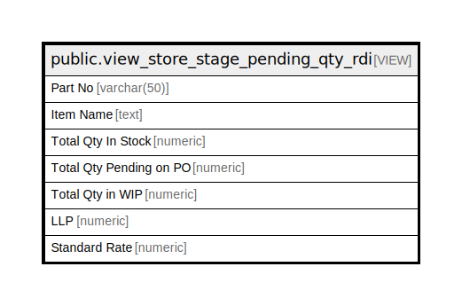

# public.view_store_stage_pending_qty_rdi

## Description

<details>
<summary><strong>Table Definition</strong></summary>

```sql
CREATE VIEW view_store_stage_pending_qty_rdi AS (
 SELECT itm.itemcode AS "Part No",
    itm.itemname AS "Item Name",
    COALESCE(storestock.storestock, (0)::numeric) AS "Total Qty In Stock",
    COALESCE(postock.pendingqty, (0)::numeric) AS "Total Qty Pending on PO",
    COALESCE(stgstock.stagestock, (0)::numeric) AS "Total Qty in WIP",
    COALESCE(llp.rate, (0)::numeric) AS "LLP",
    COALESCE(llp.costprice, (0)::numeric) AS "Standard Rate"
   FROM ((((view_item itm
     LEFT JOIN ( SELECT itm_1.itemid,
            sum(stk.baseqty) AS storestock
           FROM (rpt_storestock(1, ('now'::text)::date, ('now'::text)::date) stk(itemid, storeid, baseqty, altqty, totalcostprice)
             JOIN view_item itm_1(itemid, itemname, itemcode, drawingno, itemcategory, unitid, basedecimalplaces, baseunit, revisionno, issueno, isactive, conversion, altunitid, denominator, altdecimalplaces, altunit, bomid, isbomnotrequiredforproduction, field1, description, isproductionbasedonreversecalculation, isserialonaltunit, isbatchonaltunit, calculationbasedon, isenableseries, isinspectionrequired, isenablebatchcreation, openingbasestock, openingaltstock, groupid, printname, cstrate, vatrate, packingunit, packsizeof, exciseclassificationid, groupname, trancdefaultmmunit4rate, postolerance, subtolerance, dissallowmodvat, reporting_unit, warranty_period, isexpirydatemandatory, mrp_inclusive_tax, isusedforserviceitem, sampleqcenabled, attributevalue12, attributevalue13, standard, itemfactor, itemlabelclaim, gross_weight, net_weight, attributevalue11, attributevalue12_1, isamount, attributevalue13_1, attributevalue14, attributevalue15, nameintally, density) ON (((stk.itemid = itm_1.itemid) AND (itm_1.isactive = true))))
          GROUP BY itm_1.itemid) storestock ON ((itm.itemid = storestock.itemid)))
     LEFT JOIN ( SELECT itm_1.itemid,
            sum(stk.baseqty) AS stagestock
           FROM (rpt_stagestock(1, ('now'::text)::date, ('now'::text)::date) stk(itemid, storeid, baseqty, altqty)
             JOIN view_item itm_1(itemid, itemname, itemcode, drawingno, itemcategory, unitid, basedecimalplaces, baseunit, revisionno, issueno, isactive, conversion, altunitid, denominator, altdecimalplaces, altunit, bomid, isbomnotrequiredforproduction, field1, description, isproductionbasedonreversecalculation, isserialonaltunit, isbatchonaltunit, calculationbasedon, isenableseries, isinspectionrequired, isenablebatchcreation, openingbasestock, openingaltstock, groupid, printname, cstrate, vatrate, packingunit, packsizeof, exciseclassificationid, groupname, trancdefaultmmunit4rate, postolerance, subtolerance, dissallowmodvat, reporting_unit, warranty_period, isexpirydatemandatory, mrp_inclusive_tax, isusedforserviceitem, sampleqcenabled, attributevalue12, attributevalue13, standard, itemfactor, itemlabelclaim, gross_weight, net_weight, attributevalue11, attributevalue12_1, isamount, attributevalue13_1, attributevalue14, attributevalue15, nameintally, density) ON (((stk.itemid = itm_1.itemid) AND (itm_1.isactive = true))))
          GROUP BY itm_1.itemid) stgstock ON ((itm.itemid = stgstock.itemid)))
     LEFT JOIN ( SELECT x.itemid,
            sum(x.rate) AS rate,
            sum(x.costprice) AS costprice
           FROM ( SELECT pur_purchaseinvoicedetail.itemid,
                        CASE
                            WHEN (pur_purchaseinvoicedetail.isaltrate = 1) THEN
                            CASE
                                WHEN (COALESCE(pur_purchaseinvoicedetail.baseqty, (0)::numeric) = (0)::numeric) THEN round(pur_purchaseinvoicedetail.landedrate, 2)
                                ELSE round((pur_purchaseinvoicedetail.grossamount / pur_purchaseinvoicedetail.baseqty), 2)
                            END
                            ELSE round(pur_purchaseinvoicedetail.landedrate, 2)
                        END AS rate,
                    0 AS costprice
                   FROM (pur_purchaseinvoicedetail
                     JOIN ( SELECT poid.itemid,
                            max(poid.invoicedetailid) AS invoicedetailid
                           FROM (pur_purchaseinvoicedetail poid
                             JOIN pur_purchaseinvoice po ON ((po.invoiceid = poid.invoiceid)))
                          WHERE ((po.iscancelled = false) AND (po.isauthorized = true) AND (po.branchid = 1) AND (po.invoicedate <= ('now'::text)::date))
                          GROUP BY poid.itemid) z ON ((z.invoicedetailid = pur_purchaseinvoicedetail.invoicedetailid)))
                UNION ALL
                 SELECT isr.itemid,
                    0 AS rate,
                    isr.costprice
                   FROM (stor_itemstandardrate isr
                     JOIN ( SELECT stor_itemstandardrate.itemid,
                            max(stor_itemstandardrate.standardrateid) AS rateid
                           FROM stor_itemstandardrate
                          WHERE ((stor_itemstandardrate.applicabledate <= ('now'::text)::date) AND (stor_itemstandardrate.branchid = 1))
                          GROUP BY stor_itemstandardrate.itemid) isrd ON ((isrd.rateid = isr.standardrateid)))) x
          GROUP BY x.itemid) llp ON ((itm.itemid = llp.itemid)))
     LEFT JOIN ( SELECT itm_1.itemid,
            sum(COALESCE(tmp.pendingqty, (0)::numeric)) AS pendingqty
           FROM (((( SELECT rptpendingpo.poid,
                    rptpendingpo.podetailid,
                    rptpendingpo.podate,
                    rptpendingpo.pono,
                    rptpendingpo.potype,
                    rptpendingpo.partyname,
                    rptpendingpo.itemid,
                    rptpendingpo.poqty,
                    rptpendingpo.poaltqty,
                    rptpendingpo.pendingqty,
                    rptpendingpo.pendingaltqty
                   FROM rptpendingpo(1, false) rptpendingpo(poid, podetailid, podate, pono, potype, partyname, itemid, poqty, poaltqty, pendingqty, pendingaltqty)
                  WHERE (rptpendingpo.pendingqty > (0)::numeric)) tmp
             JOIN view_item itm_1 ON (((tmp.itemid = itm_1.itemid) AND (tmp.podate <= ('now'::text)::date) AND (itm_1.itemcategory <> ALL (ARRAY[5, 9, 11])))))
             JOIN pur_purchaseorder po ON ((po.poid = tmp.poid)))
             JOIN pur_poitemdetail pod ON ((pod.podetailid = tmp.podetailid)))
          WHERE ((po.isclosed = false) AND (pod.isclosed = false) AND (pod.deactive = false) AND ((tmp.potype)::text <> 'FAPO'::text))
          GROUP BY itm_1.itemid) postock ON ((itm.itemid = postock.itemid)))
  WHERE ((itm.isactive = true) AND (itm.itemcategory <> ALL (ARRAY[5, 9, 11])))
  ORDER BY itm.itemname
)
```

</details>

## Columns

| Name | Type | Default | Nullable | Children | Parents | Comment |
| ---- | ---- | ------- | -------- | -------- | ------- | ------- |
| Part No | varchar(50) |  | true |  |  |  |
| Item Name | text |  | true |  |  |  |
| Total Qty In Stock | numeric |  | true |  |  |  |
| Total Qty Pending on PO | numeric |  | true |  |  |  |
| Total Qty in WIP | numeric |  | true |  |  |  |
| LLP | numeric |  | true |  |  |  |
| Standard Rate | numeric |  | true |  |  |  |

## Referenced Tables

| Name | Columns | Comment | Type |
| ---- | ------- | ------- | ---- |
| [public.view_item](public.view_item.md) | 62 |  | VIEW |
| [rpt_storestock](rpt_storestock.md) | 0 |  |  |
| [rpt_stagestock](rpt_stagestock.md) | 0 |  |  |
| [public.pur_purchaseinvoicedetail](public.pur_purchaseinvoicedetail.md) | 89 |  | BASE TABLE |
| [public.pur_purchaseinvoice](public.pur_purchaseinvoice.md) | 114 |  | BASE TABLE |
| [public.stor_itemstandardrate](public.stor_itemstandardrate.md) | 20 |  | BASE TABLE |
| [rptpendingpo](rptpendingpo.md) | 0 |  |  |
| [public.pur_purchaseorder](public.pur_purchaseorder.md) | 109 |  | BASE TABLE |
| [public.pur_poitemdetail](public.pur_poitemdetail.md) | 71 |  | BASE TABLE |

## Relations



---

> Generated by [tbls](https://github.com/k1LoW/tbls)
