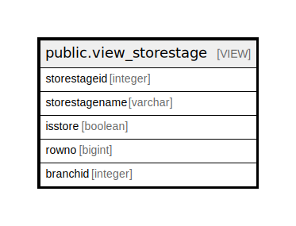

# public.view_storestage

## Description

<details>
<summary><strong>Table Definition</strong></summary>

```sql
CREATE VIEW view_storestage AS (
 SELECT storestageid,
    storestagename,
    isstore,
    row_number() OVER () AS rowno,
    branchid
   FROM ( SELECT stor_storemaster.storeid AS storestageid,
            stor_storemaster.storename AS storestagename,
            true AS isstore,
            stor_storemaster.branchid
           FROM stor_storemaster
        UNION
         SELECT prod_stagemaster.stageid,
            prod_stagemaster.stage,
            false AS bool,
            0
           FROM prod_stagemaster) t
)
```

</details>

## Columns

| Name | Type | Default | Nullable | Children | Parents | Comment |
| ---- | ---- | ------- | -------- | -------- | ------- | ------- |
| storestageid | integer |  | true |  |  |  |
| storestagename | varchar |  | true |  |  |  |
| isstore | boolean |  | true |  |  |  |
| rowno | bigint |  | true |  |  |  |
| branchid | integer |  | true |  |  |  |

## Referenced Tables

| Name | Columns | Comment | Type |
| ---- | ------- | ------- | ---- |
| [public.stor_storemaster](public.stor_storemaster.md) | 27 |  | BASE TABLE |
| [public.prod_stagemaster](public.prod_stagemaster.md) | 17 |  | BASE TABLE |

## Relations



---

> Generated by [tbls](https://github.com/k1LoW/tbls)
