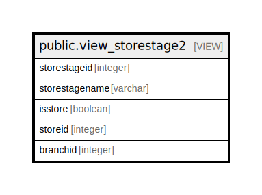

# public.view_storestage2

## Description

<details>
<summary><strong>Table Definition</strong></summary>

```sql
CREATE VIEW view_storestage2 AS (
 SELECT stor_storemaster.storestageid,
    stor_storemaster.storename AS storestagename,
    true AS isstore,
    stor_storemaster.storeid,
    stor_storemaster.branchid
   FROM stor_storemaster
UNION
 SELECT prod_stagemaster.storestageid,
    prod_stagemaster.stage AS storestagename,
    false AS isstore,
    prod_stagemaster.stageid AS storeid,
    0 AS branchid
   FROM prod_stagemaster
)
```

</details>

## Columns

| Name | Type | Default | Nullable | Children | Parents | Comment |
| ---- | ---- | ------- | -------- | -------- | ------- | ------- |
| storestageid | integer |  | true |  |  |  |
| storestagename | varchar |  | true |  |  |  |
| isstore | boolean |  | true |  |  |  |
| storeid | integer |  | true |  |  |  |
| branchid | integer |  | true |  |  |  |

## Referenced Tables

| Name | Columns | Comment | Type |
| ---- | ------- | ------- | ---- |
| [public.stor_storemaster](public.stor_storemaster.md) | 27 |  | BASE TABLE |
| [public.prod_stagemaster](public.prod_stagemaster.md) | 17 |  | BASE TABLE |

## Relations



---

> Generated by [tbls](https://github.com/k1LoW/tbls)
