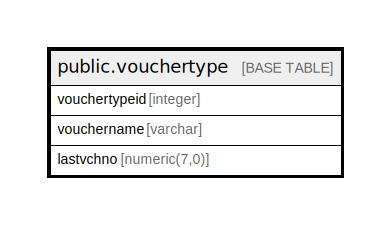

# public.vouchertype

## Description

## Columns

| Name | Type | Default | Nullable | Children | Parents | Comment |
| ---- | ---- | ------- | -------- | -------- | ------- | ------- |
| vouchertypeid | integer | nextval('vouchertype_vouchertypeid_seq'::regclass) | false |  |  |  |
| vouchername | varchar |  | true |  |  |  |
| lastvchno | numeric(7,0) | 0 | true |  |  |  |

## Constraints

| Name | Type | Definition |
| ---- | ---- | ---------- |
| vouchertype_pkey | PRIMARY KEY | PRIMARY KEY (vouchertypeid) |

## Indexes

| Name | Definition |
| ---- | ---------- |
| vouchertype_pkey | CREATE UNIQUE INDEX vouchertype_pkey ON public.vouchertype USING btree (vouchertypeid) |

## Relations

---

> Generated by [tbls](https://github.com/k1LoW/tbls)
