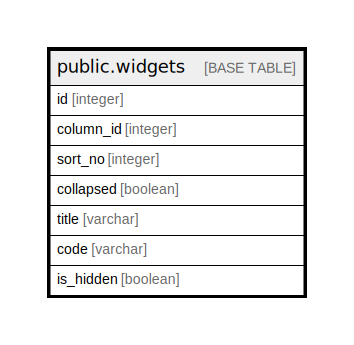

# public.widgets

## Description

## Columns

| Name | Type | Default | Nullable | Children | Parents | Comment |
| ---- | ---- | ------- | -------- | -------- | ------- | ------- |
| id | integer |  | false |  |  |  |
| column_id | integer |  | true |  |  |  |
| sort_no | integer |  | true |  |  |  |
| collapsed | boolean |  | true |  |  |  |
| title | varchar |  | true |  |  |  |
| code | varchar |  | true |  |  |  |
| is_hidden | boolean |  | true |  |  |  |

## Constraints

| Name | Type | Definition |
| ---- | ---- | ---------- |
| widgets_pkey | PRIMARY KEY | PRIMARY KEY (id) |

## Indexes

| Name | Definition |
| ---- | ---------- |
| widgets_pkey | CREATE UNIQUE INDEX widgets_pkey ON public.widgets USING btree (id) |

## Relations

---

> Generated by [tbls](https://github.com/k1LoW/tbls)
