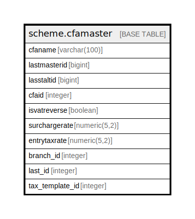

# scheme.cfamaster

## Description

## Columns

| Name | Type | Default | Nullable | Children | Parents | Comment |
| ---- | ---- | ------- | -------- | -------- | ------- | ------- |
| cfaname | varchar(100) |  | true |  |  |  |
| lastmasterid | bigint |  | true |  |  |  |
| lasstaltid | bigint |  | true |  |  |  |
| cfaid | integer | nextval('scheme.cfamaster_cfaid_seq'::regclass) | false |  |  |  |
| isvatreverse | boolean |  | true |  |  |  |
| surchargerate | numeric(5,2) |  | true |  |  |  |
| entrytaxrate | numeric(5,2) |  | true |  |  |  |
| branch_id | integer |  | true |  |  |  |
| last_id | integer |  | true |  |  |  |
| tax_template_id | integer |  | true |  |  |  |

## Constraints

| Name | Type | Definition |
| ---- | ---- | ---------- |
| cfamaster_cfaname_key | UNIQUE | UNIQUE (cfaname) |

## Indexes

| Name | Definition |
| ---- | ---------- |
| cfamaster_cfaname_key | CREATE UNIQUE INDEX cfamaster_cfaname_key ON scheme.cfamaster USING btree (cfaname) |

## Relations

---

> Generated by [tbls](https://github.com/k1LoW/tbls)
