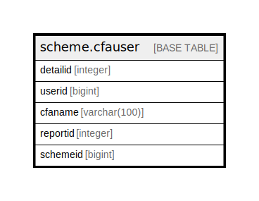

# scheme.cfauser

## Description

## Columns

| Name | Type | Default | Nullable | Children | Parents | Comment |
| ---- | ---- | ------- | -------- | -------- | ------- | ------- |
| detailid | integer | nextval('scheme.cfauser_detailid_seq'::regclass) | false |  |  |  |
| userid | bigint |  | true |  |  |  |
| cfaname | varchar(100) |  | true |  |  |  |
| reportid | integer |  | true |  |  |  |
| schemeid | bigint |  | true |  |  |  |

## Constraints

| Name | Type | Definition |
| ---- | ---- | ---------- |
| cfauser_pkey | PRIMARY KEY | PRIMARY KEY (detailid) |

## Indexes

| Name | Definition |
| ---- | ---------- |
| cfauser_pkey | CREATE UNIQUE INDEX cfauser_pkey ON scheme.cfauser USING btree (detailid) |

## Relations

---

> Generated by [tbls](https://github.com/k1LoW/tbls)
