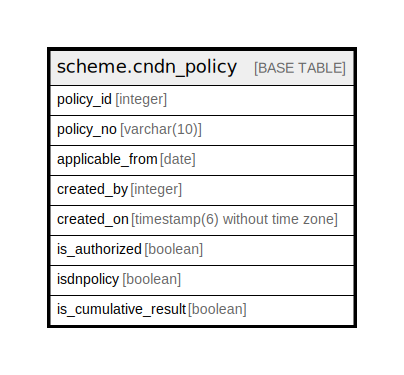

# scheme.cndn_policy

## Description

## Columns

| Name | Type | Default | Nullable | Children | Parents | Comment |
| ---- | ---- | ------- | -------- | -------- | ------- | ------- |
| policy_id | integer | nextval('scheme.cndn_policy_policy_id_seq'::regclass) | false |  |  |  |
| policy_no | varchar(10) | NULL::character varying | true |  |  |  |
| applicable_from | date |  | true |  |  |  |
| created_by | integer |  | true |  |  |  |
| created_on | timestamp(6) without time zone |  | true |  |  |  |
| is_authorized | boolean |  | true |  |  |  |
| isdnpolicy | boolean |  | true |  |  |  |
| is_cumulative_result | boolean | false | false |  |  |  |

## Constraints

| Name | Type | Definition |
| ---- | ---- | ---------- |
| cndn_policy_pkey | PRIMARY KEY | PRIMARY KEY (policy_id) |

## Indexes

| Name | Definition |
| ---- | ---------- |
| cndn_policy_pkey | CREATE UNIQUE INDEX cndn_policy_pkey ON scheme.cndn_policy USING btree (policy_id) |

## Relations

---

> Generated by [tbls](https://github.com/k1LoW/tbls)
