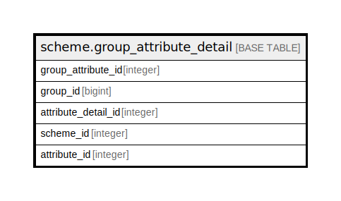

# scheme.group_attribute_detail

## Description

## Columns

| Name | Type | Default | Nullable | Children | Parents | Comment |
| ---- | ---- | ------- | -------- | -------- | ------- | ------- |
| group_attribute_id | integer | nextval('scheme.group_attribute_detail_group_attribute_id_seq'::regclass) | false |  |  |  |
| group_id | bigint |  | false |  |  |  |
| attribute_detail_id | integer |  | false |  |  |  |
| scheme_id | integer |  | false |  |  |  |
| attribute_id | integer | 0 | false |  |  |  |

## Constraints

| Name | Type | Definition |
| ---- | ---- | ---------- |
| group_attribute_detail_pkey | PRIMARY KEY | PRIMARY KEY (group_attribute_id) |

## Indexes

| Name | Definition |
| ---- | ---------- |
| group_attribute_detail_pkey | CREATE UNIQUE INDEX group_attribute_detail_pkey ON scheme.group_attribute_detail USING btree (group_attribute_id) |

## Relations

---

> Generated by [tbls](https://github.com/k1LoW/tbls)
