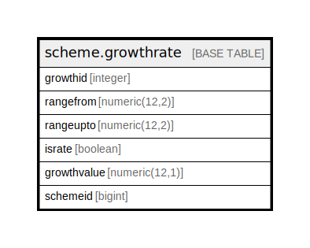

# scheme.growthrate

## Description

## Columns

| Name | Type | Default | Nullable | Children | Parents | Comment |
| ---- | ---- | ------- | -------- | -------- | ------- | ------- |
| growthid | integer | nextval('scheme.growthrate_growthid_seq'::regclass) | false |  |  |  |
| rangefrom | numeric(12,2) |  | true |  |  |  |
| rangeupto | numeric(12,2) |  | true |  |  |  |
| israte | boolean | false | true |  |  |  |
| growthvalue | numeric(12,1) |  | true |  |  |  |
| schemeid | bigint |  | true |  |  |  |

## Constraints

| Name | Type | Definition |
| ---- | ---- | ---------- |
| growthrate_pkey | PRIMARY KEY | PRIMARY KEY (growthid) |

## Indexes

| Name | Definition |
| ---- | ---------- |
| growthrate_pkey | CREATE UNIQUE INDEX growthrate_pkey ON scheme.growthrate USING btree (growthid) |

## Relations

---

> Generated by [tbls](https://github.com/k1LoW/tbls)
