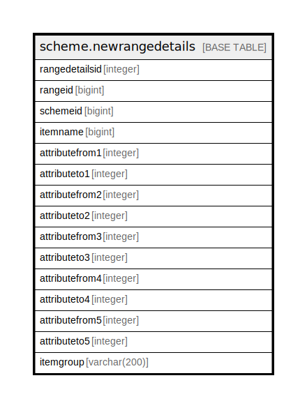

# scheme.newrangedetails

## Description

## Columns

| Name | Type | Default | Nullable | Children | Parents | Comment |
| ---- | ---- | ------- | -------- | -------- | ------- | ------- |
| rangedetailsid | integer | nextval('scheme.newrangedetails_rangedetailsid_seq'::regclass) | false |  |  |  |
| rangeid | bigint |  | true |  |  |  |
| schemeid | bigint |  | true |  |  |  |
| itemname | bigint |  | true |  |  |  |
| attributefrom1 | integer |  | true |  |  |  |
| attributeto1 | integer |  | true |  |  |  |
| attributefrom2 | integer |  | true |  |  |  |
| attributeto2 | integer |  | true |  |  |  |
| attributefrom3 | integer |  | true |  |  |  |
| attributeto3 | integer |  | true |  |  |  |
| attributefrom4 | integer |  | true |  |  |  |
| attributeto4 | integer |  | true |  |  |  |
| attributefrom5 | integer |  | true |  |  |  |
| attributeto5 | integer |  | true |  |  |  |
| itemgroup | varchar(200) |  | true |  |  |  |

## Constraints

| Name | Type | Definition |
| ---- | ---- | ---------- |
| newrangedetails_pkey | PRIMARY KEY | PRIMARY KEY (rangedetailsid) |

## Indexes

| Name | Definition |
| ---- | ---------- |
| newrangedetails_pkey | CREATE UNIQUE INDEX newrangedetails_pkey ON scheme.newrangedetails USING btree (rangedetailsid) |

## Relations

---

> Generated by [tbls](https://github.com/k1LoW/tbls)
