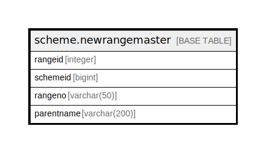

# scheme.newrangemaster

## Description

## Columns

| Name | Type | Default | Nullable | Children | Parents | Comment |
| ---- | ---- | ------- | -------- | -------- | ------- | ------- |
| rangeid | integer | nextval('scheme.newrangemaster_rangeid_seq'::regclass) | false |  |  |  |
| schemeid | bigint |  | true |  |  |  |
| rangeno | varchar(50) |  | true |  |  |  |
| parentname | varchar(200) |  | true |  |  |  |

## Constraints

| Name | Type | Definition |
| ---- | ---- | ---------- |
| newrangemaster_pkey | PRIMARY KEY | PRIMARY KEY (rangeid) |

## Indexes

| Name | Definition |
| ---- | ---------- |
| newrangemaster_pkey | CREATE UNIQUE INDEX newrangemaster_pkey ON scheme.newrangemaster USING btree (rangeid) |

## Relations

---

> Generated by [tbls](https://github.com/k1LoW/tbls)
