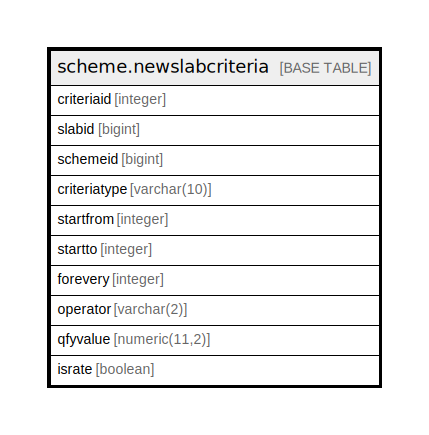

# scheme.newslabcriteria

## Description

## Columns

| Name | Type | Default | Nullable | Children | Parents | Comment |
| ---- | ---- | ------- | -------- | -------- | ------- | ------- |
| criteriaid | integer | nextval('scheme.newslabcriteria_criteriaid_seq'::regclass) | false |  |  |  |
| slabid | bigint |  | true |  |  |  |
| schemeid | bigint |  | true |  |  |  |
| criteriatype | varchar(10) |  | true |  |  |  |
| startfrom | integer |  | true |  |  |  |
| startto | integer |  | true |  |  |  |
| forevery | integer |  | true |  |  |  |
| operator | varchar(2) | NULL::character varying | true |  |  |  |
| qfyvalue | numeric(11,2) | NULL::numeric | true |  |  |  |
| israte | boolean |  | true |  |  |  |

## Constraints

| Name | Type | Definition |
| ---- | ---- | ---------- |
| newslabcriteria_pkey | PRIMARY KEY | PRIMARY KEY (criteriaid) |

## Indexes

| Name | Definition |
| ---- | ---------- |
| newslabcriteria_pkey | CREATE UNIQUE INDEX newslabcriteria_pkey ON scheme.newslabcriteria USING btree (criteriaid) |

## Relations

---

> Generated by [tbls](https://github.com/k1LoW/tbls)
