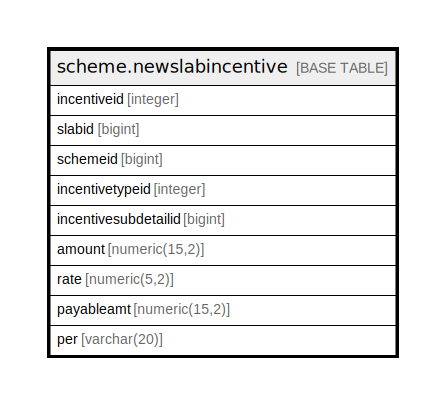

# scheme.newslabincentive

## Description

## Columns

| Name | Type | Default | Nullable | Children | Parents | Comment |
| ---- | ---- | ------- | -------- | -------- | ------- | ------- |
| incentiveid | integer | nextval('scheme.newslabincentive_incentiveid_seq'::regclass) | false |  |  |  |
| slabid | bigint |  | true |  |  |  |
| schemeid | bigint |  | true |  |  |  |
| incentivetypeid | integer |  | true |  |  |  |
| incentivesubdetailid | bigint |  | true |  |  |  |
| amount | numeric(15,2) |  | true |  |  |  |
| rate | numeric(5,2) |  | true |  |  |  |
| payableamt | numeric(15,2) |  | true |  |  |  |
| per | varchar(20) |  | true |  |  |  |

## Constraints

| Name | Type | Definition |
| ---- | ---- | ---------- |
| newslabincentive_pkey | PRIMARY KEY | PRIMARY KEY (incentiveid) |

## Indexes

| Name | Definition |
| ---- | ---------- |
| newslabincentive_pkey | CREATE UNIQUE INDEX newslabincentive_pkey ON scheme.newslabincentive USING btree (incentiveid) |

## Relations

---

> Generated by [tbls](https://github.com/k1LoW/tbls)
