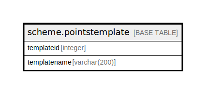

# scheme.pointstemplate

## Description

## Columns

| Name | Type | Default | Nullable | Children | Parents | Comment |
| ---- | ---- | ------- | -------- | -------- | ------- | ------- |
| templateid | integer | nextval('scheme.pointstemplate_templateid_seq'::regclass) | false |  |  |  |
| templatename | varchar(200) |  | true |  |  |  |

## Constraints

| Name | Type | Definition |
| ---- | ---- | ---------- |
| pointstemplate_pkey | PRIMARY KEY | PRIMARY KEY (templateid) |

## Indexes

| Name | Definition |
| ---- | ---------- |
| pointstemplate_pkey | CREATE UNIQUE INDEX pointstemplate_pkey ON scheme.pointstemplate USING btree (templateid) |

## Relations

---

> Generated by [tbls](https://github.com/k1LoW/tbls)
