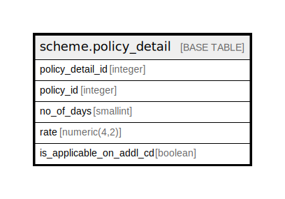

# scheme.policy_detail

## Description

## Columns

| Name | Type | Default | Nullable | Children | Parents | Comment |
| ---- | ---- | ------- | -------- | -------- | ------- | ------- |
| policy_detail_id | integer | nextval('scheme.policy_detail_policy_detail_id_seq'::regclass) | false |  |  |  |
| policy_id | integer |  | true |  |  |  |
| no_of_days | smallint |  | true |  |  |  |
| rate | numeric(4,2) | NULL::numeric | true |  |  |  |
| is_applicable_on_addl_cd | boolean |  | true |  |  |  |

## Constraints

| Name | Type | Definition |
| ---- | ---- | ---------- |
| policy_detail_pkey | PRIMARY KEY | PRIMARY KEY (policy_detail_id) |

## Indexes

| Name | Definition |
| ---- | ---------- |
| policy_detail_pkey | CREATE UNIQUE INDEX policy_detail_pkey ON scheme.policy_detail USING btree (policy_detail_id) |

## Relations

---

> Generated by [tbls](https://github.com/k1LoW/tbls)
