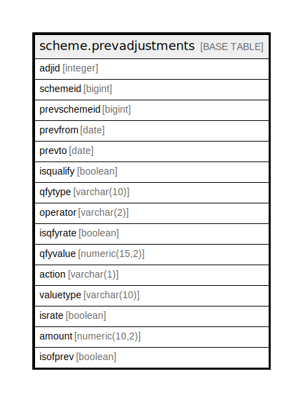

# scheme.prevadjustments

## Description

## Columns

| Name | Type | Default | Nullable | Children | Parents | Comment |
| ---- | ---- | ------- | -------- | -------- | ------- | ------- |
| adjid | integer | nextval('scheme.prevadjustments_adjid_seq'::regclass) | false |  |  |  |
| schemeid | bigint |  | true |  |  |  |
| prevschemeid | bigint |  | true |  |  |  |
| prevfrom | date |  | true |  |  |  |
| prevto | date |  | true |  |  |  |
| isqualify | boolean |  | true |  |  |  |
| qfytype | varchar(10) |  | true |  |  |  |
| operator | varchar(2) |  | true |  |  |  |
| isqfyrate | boolean |  | true |  |  |  |
| qfyvalue | numeric(15,2) |  | true |  |  |  |
| action | varchar(1) |  | true |  |  |  |
| valuetype | varchar(10) |  | true |  |  |  |
| israte | boolean |  | true |  |  |  |
| amount | numeric(10,2) |  | true |  |  |  |
| isofprev | boolean |  | true |  |  |  |

## Constraints

| Name | Type | Definition |
| ---- | ---- | ---------- |
| prevadjustments_pkey | PRIMARY KEY | PRIMARY KEY (adjid) |

## Indexes

| Name | Definition |
| ---- | ---------- |
| prevadjustments_pkey | CREATE UNIQUE INDEX prevadjustments_pkey ON scheme.prevadjustments USING btree (adjid) |

## Relations

---

> Generated by [tbls](https://github.com/k1LoW/tbls)
